This document will cover the process of creating and updating releases in the Sentry application. We'll cover:

1. The creation of a new release
2. Updating release details
3. Saving avatar for the release
4. Updating file details for the release
5. Updating project details for the release.

```mermaid
graph TD;
subgraph src/sentry/api/endpoints
  post:::mainFlowStyle --> get
end
subgraph src/sentry/models
  post:::mainFlowStyle --> set_commits
end
subgraph src/sentry/models
  post:::mainFlowStyle --> set_refs
end
subgraph src/sentry/utils
  post:::mainFlowStyle --> bind_organization_context
end
subgraph src/sentry/api/endpoints
  post:::mainFlowStyle --> save
end
subgraph src/sentry/api/endpoints
  get --> _filter_releases_by_query
end
subgraph src/sentry/api/endpoints
  get --> debounce_update_release_health_data
end
subgraph src/sentry/api
  get --> paginate
end
subgraph src/sentry/api/endpoints
  _filter_releases_by_query --> get
end
subgraph src/sentry/api
  _filter_releases_by_query --> parse_search_query
end
subgraph src/sentry/api/endpoints
  debounce_update_release_health_data --> get
end
subgraph src/sentry/db/models
  debounce_update_release_health_data --> get_many_from_cache
end
subgraph src/sentry/api
  paginate --> get_result
end
subgraph src/sentry/api
  paginate --> on_results
end
subgraph src/sentry/models
  set_commits --> get_or_create
end
subgraph src/sentry/db/models
  set_commits --> create_or_update
end
subgraph src/sentry
  set_commits --> incr
end
subgraph src/sentry
  set_commits --> apply_async
end
subgraph src/sentry/models
  get_or_create --> _get_or_create_impl
end
subgraph src/sentry/utils
  get_or_create --> timer
end
subgraph src/sentry/db/models
  create_or_update --> update
end
subgraph src/bitfield/types.py
  create_or_update --> items
end
subgraph src/sentry
  incr --> apply_async
end
subgraph src/sentry/utils
  apply_async --> timer
end
subgraph src/sentry/models
  set_refs --> get_or_create
end
subgraph src/sentry/db/models
  set_refs --> create_or_update
end
subgraph src/sentry
  set_refs --> apply_async
end
subgraph src/sentry
  bind_organization_context --> exception
end
subgraph src/sentry
  bind_organization_context --> set_tag
end
subgraph src/sentry/utils
  exception --> captureException
end
subgraph src/sentry/api/endpoints
  save:::mainFlowStyle --> save_trusted_relays
end
subgraph src/sentry/models
  save:::mainFlowStyle --> set_value
end
subgraph src/sentry/api/endpoints
  save:::mainFlowStyle --> update_tracked_data
end
subgraph src/sentry/models
  save:::mainFlowStyle --> save_avatar
end
subgraph src/sentry/models
  save_trusted_relays --> set_value
end
subgraph src/sentry/db/models
  set_value --> create_or_update
end
subgraph src/sentry
  update_tracked_data --> exception
end
subgraph src/sentry/models
  save_avatar:::mainFlowStyle --> putfile
end
subgraph src/sentry/utils
  putfile:::mainFlowStyle --> timing
end
subgraph src/sentry/models
  putfile:::mainFlowStyle --> from_file
end
subgraph src/sentry
  timing --> exception
end
subgraph src/sentry/utils
  from_file:::mainFlowStyle --> timing
end
subgraph src/sentry/models
  from_file:::mainFlowStyle --> save
end
subgraph src/sentry/models
  from_file:::mainFlowStyle --> _get_size_and_checksum
end
subgraph src/sentry/db/models
  save --> slugify_instance
end
subgraph src/sentry
  slugify_instance --> all
end
subgraph src/sentry/models
  _get_size_and_checksum:::mainFlowStyle --> read
end
subgraph src/sentry/models
  read:::mainFlowStyle --> _nextidx
end
subgraph src/sentry/models
  _nextidx:::mainFlowStyle --> getfile
end
subgraph src/sentry/models
  getfile:::mainFlowStyle --> open
end
  open:::mainFlowStyle --> ...

 classDef mainFlowStyle color:#000000,fill:#7CB9F4
  classDef rootsStyle color:#000000,fill:#00FFF4
```



<SwmSnippet path="/src/sentry/api/endpoints/organization_releases.py" line="220">

---

# Creating a new release

The `post` function in `organization_releases.py` is responsible for creating a new release. It takes in the request and organization as parameters and returns a response. The function first retrieves the necessary parameters from the request, then it builds the queryset for the release. If the release already exists, it updates the existing release; otherwise, it creates a new release.

````````````````````````````````python
    def get(self, request: Request, organization) -> Response:
        """
        List an Organization's Releases
        ```````````````````````````````
        Return a list of releases for a given organization.

        :pparam string organization_slug: the organization short name
        :qparam string query: this parameter can be used to create a
                              "starts with" filter for the version.
        """
        query = request.GET.get("query")
        with_health = request.GET.get("health") == "1"
        with_adoption_stages = request.GET.get("adoptionStages") == "1"
        status_filter = request.GET.get("status", "open")
        flatten = request.GET.get("flatten") == "1"
        sort = request.GET.get("sort") or "date"
        health_stat = request.GET.get("healthStat") or "sessions"
        summary_stats_period = request.GET.get("summaryStatsPeriod") or "14d"
        health_stats_period = request.GET.get("healthStatsPeriod") or ("24h" if with_health else "")
        if summary_stats_period not in STATS_PERIODS:
            raise ParseError(detail=get_stats_period_detail("summaryStatsPeriod", STATS_PERIODS))
````````````````````````````````

---

</SwmSnippet>

<SwmSnippet path="/src/sentry/api/endpoints/organization_details.py" line="285">

---

# Updating release details

The `save_trusted_relays` function in `organization_details.py` is used to update the details of a release. It takes in the incoming data, changed data, and organization as parameters. The function first retrieves the existing release details, then it checks if there are any modifications. If there are modifications, it updates the existing release details; otherwise, it creates new release details.

```python
    def save_trusted_relays(self, incoming, changed_data, organization):
        timestamp_now = datetime.utcnow().replace(tzinfo=UTC).isoformat()
        option_key = "sentry:trusted-relays"
        try:
            # get what we already have
            existing = OrganizationOption.objects.get(organization=organization, key=option_key)

            key_dict = {val.get("public_key"): val for val in existing.value}
            original_number_of_keys = len(existing.value)
        except OrganizationOption.DoesNotExist:
            key_dict = {}  # we don't have anything set
            original_number_of_keys = 0
            existing = None

        modified = False
        for option in incoming:
            public_key = option.get("public_key")
            existing_info = key_dict.get(public_key, {})

            option["created"] = existing_info.get("created", timestamp_now)
            option["last_modified"] = existing_info.get("last_modified")
```

---

</SwmSnippet>

<SwmSnippet path="/src/sentry/models/avatars/base.py" line="389">

---

# Saving avatar for the release

The `putfile` function in `file.py` is used to save the avatar for the release. It takes in the file object and blob size as parameters. The function reads the file object and saves it into a number of chunks. The chunks are then saved into the file blob.

```python

```

---

</SwmSnippet>

<SwmSnippet path="/src/sentry/models/file.py" line="616">

---

# Updating file details for the release

The `read` function in `file.py` is used to update the file details for the release. It reads the file and updates the file details accordingly.

```python
    def read(self, n=-1):
        if self.closed:
            raise ValueError("I/O operation on closed file")

        if self.prefetched:
            return self._curfile.read(n)

        result = bytearray()

        # Read to the end of the file
        if n < 0:
            while self._curfile is not None:
                blob_result = self._curfile.read(32768)
                if not blob_result:
                    self._nextidx()
                else:
                    result.extend(blob_result)

        # Read until a certain number of bytes are read
        else:
            while n > 0 and self._curfile is not None:
```

---

</SwmSnippet>

<SwmSnippet path="/src/sentry/models/project.py" line="515">

---

# Updating project details for the release

The `slugify_instance` function in `utils.py` is used to update the project details for the release. It takes in the instance and label as parameters and returns the updated project details.

```python

```

---

</SwmSnippet>

&nbsp;

*This is an auto-generated document by Swimm AI 🌊 and has not yet been verified by a human*

<SwmMeta version="3.0.0" repo-id="Z2l0aHViJTNBJTNBZGVtby1zZW50cnklM0ElM0Fzd2ltbWlv" repo-name="demo-sentry"><sup>Powered by [Swimm](/)</sup></SwmMeta>
