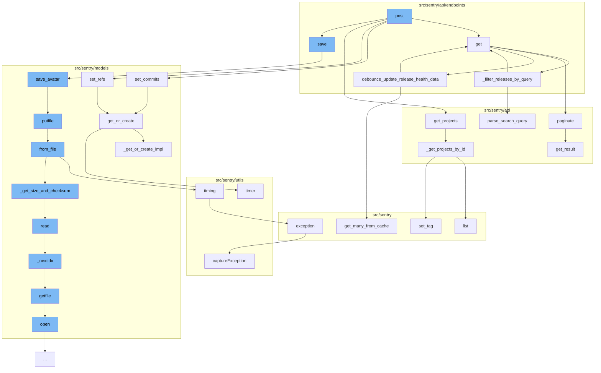

This document will cover the process of creating and saving a new release in the Sentry application. The steps include:

1. Posting a new release
2. Getting the release details
3. Setting commits and references for the release
4. Getting the projects associated with the release
5. Saving the release details.



<SwmSnippet path="/src/sentry/api/endpoints/organization_releases.py" line="220">

---

# Posting a new release

The `post` function in `organization_releases.py` is the entry point for creating a new release. It takes in the request and organization details, and returns a list of releases for the given organization.

````````````````````````````````python
    def get(self, request: Request, organization) -> Response:
        """
        List an Organization's Releases
        ```````````````````````````````
        Return a list of releases for a given organization.

        :pparam string organization_slug: the organization short name
        :qparam string query: this parameter can be used to create a
                              "starts with" filter for the version.
        """
        query = request.GET.get("query")
        with_health = request.GET.get("health") == "1"
        with_adoption_stages = request.GET.get("adoptionStages") == "1"
        status_filter = request.GET.get("status", "open")
        flatten = request.GET.get("flatten") == "1"
        sort = request.GET.get("sort") or "date"
        health_stat = request.GET.get("healthStat") or "sessions"
        summary_stats_period = request.GET.get("summaryStatsPeriod") or "14d"
        health_stats_period = request.GET.get("healthStatsPeriod") or ("24h" if with_health else "")
        if summary_stats_period not in STATS_PERIODS:
            raise ParseError(detail=get_stats_period_detail("summaryStatsPeriod", STATS_PERIODS))
````````````````````````````````

---

</SwmSnippet>

<SwmSnippet path="/src/sentry/api/endpoints/organization_details.py" line="82">

---

# Saving the release details

The `save` function in `organization_details.py` is responsible for saving the details of the release, including the avatar associated with the release.

```python
    (
        "attachmentsRole",
        "sentry:attachments_role",
        str,
        org_serializers.ATTACHMENTS_ROLE_DEFAULT,
    ),
    (
        "debugFilesRole",
        "sentry:debug_files_role",
        str,
        org_serializers.DEBUG_FILES_ROLE_DEFAULT,
    ),
    (
        "eventsMemberAdmin",
        "sentry:events_member_admin",
        bool,
        org_serializers.EVENTS_MEMBER_ADMIN_DEFAULT,
    ),
    (
        "alertsMemberWrite",
        "sentry:alerts_member_write",
```

---

</SwmSnippet>

&nbsp;

*This is an auto-generated document by Swimm AI 🌊 and has not yet been verified by a human*

<SwmMeta version="3.0.0" repo-id="Z2l0aHViJTNBJTNBZGVtby1zZW50cnklM0ElM0Fzd2ltbWlv" repo-name="demo-sentry"><sup>Powered by [Swimm](/)</sup></SwmMeta>
