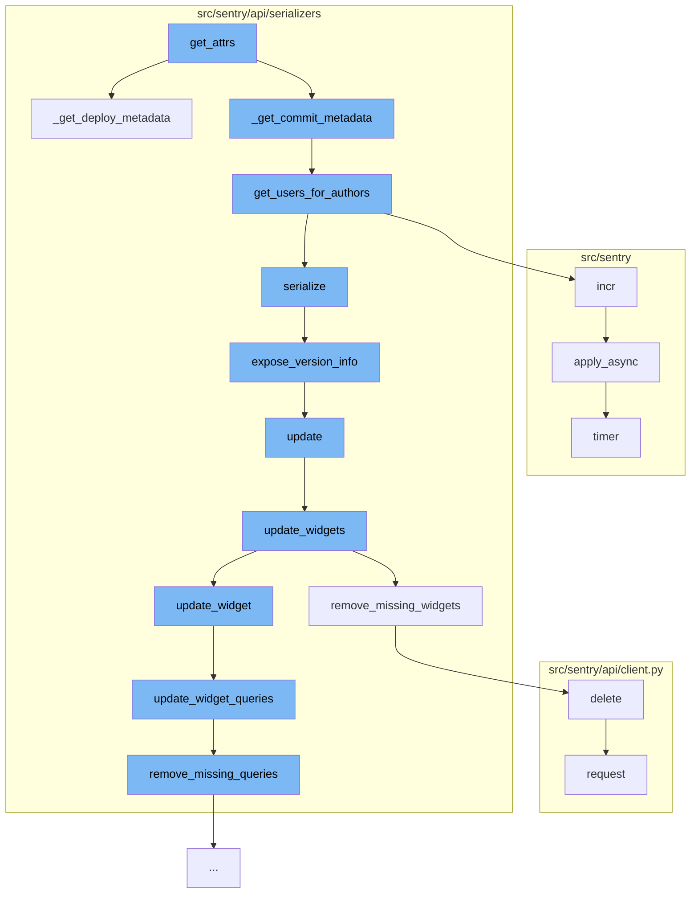

This document will cover the process of handling release metadata in the Sentry application. The process includes:

1. Retrieving attributes for a release
2. Gathering commit metadata
3. Gathering deploy metadata
4. Serializing the release data
5. Updating the dashboard with the release data.



<SwmSnippet path="/src/sentry/api/serializers/models/release.py" line="180">

---

# Retrieving attributes for a release

The `get_attrs` function is the entry point for this flow. It calls `_get_deploy_metadata` and `_get_commit_metadata` to gather information about the release's deployments and commits respectively.

```python
    def _get_deploy_metadata(self, item_list, user):
        """
        Returns a dictionary of release_id => commit metadata,
        where each commit metadata dict contains commit_count
        and an array of authors.
        e.g.
        {
            1: {
                'latest_commit': <Commit id=1>,
                'authors': [<User id=1>, <User id=2>]
            },
            ...
        }
        """
        deploy_ids = {o.last_deploy_id for o in item_list if o.last_deploy_id}
        if deploy_ids:
            deploy_list = list(Deploy.objects.filter(id__in=deploy_ids))
            deploys = {d.id: c for d, c in zip(deploy_list, serialize(deploy_list, user))}
        else:
            deploys = {}

```

---

</SwmSnippet>

<SwmSnippet path="/src/sentry/api/serializers/models/release.py" line="54">

---

# Gathering commit metadata

`_get_commit_metadata` function calls `get_users_for_authors` to map authors to users in the Sentry system. This is used to associate commits with specific users.

```python
def get_users_for_authors(organization_id, authors, user=None):
    """
    Returns a dictionary of author_id => user, if a Sentry
    user object exists for that email. If there is no matching
    Sentry user, a {user, email} dict representation of that
    author is returned.
    e.g.
    {
        1: serialized(<User id=1>),
        2: {email: 'not-a-user@example.com', name: 'dunno'},
        ...
    }
    """
    results = {}

    fetched = cache.get_many(
        [_user_to_author_cache_key(organization_id, author) for author in authors]
    )
    if fetched:
        missed = []
        for author in authors:
```

---

</SwmSnippet>

<SwmSnippet path="/src/sentry/api/serializers/models/release.py" line="180">

---

# Gathering deploy metadata

`_get_deploy_metadata` function retrieves metadata about the deployments associated with the release.

```python
    def _get_deploy_metadata(self, item_list, user):
        """
        Returns a dictionary of release_id => commit metadata,
        where each commit metadata dict contains commit_count
        and an array of authors.
        e.g.
        {
            1: {
                'latest_commit': <Commit id=1>,
                'authors': [<User id=1>, <User id=2>]
            },
            ...
        }
        """
        deploy_ids = {o.last_deploy_id for o in item_list if o.last_deploy_id}
        if deploy_ids:
            deploy_list = list(Deploy.objects.filter(id__in=deploy_ids))
            deploys = {d.id: c for d, c in zip(deploy_list, serialize(deploy_list, user))}
        else:
            deploys = {}

```

---

</SwmSnippet>

<SwmSnippet path="/src/sentry/api/serializers/models/release.py" line="26">

---

# Serializing the release data

The `serialize` function calls `expose_version_info` to format the version information for the release.

```python
def expose_version_info(info):
    if info is None:
        return None
    version = {"raw": info["version_raw"]}
    if info["version_parsed"]:
        version.update(
            {
                "major": info["version_parsed"]["major"],
                "minor": info["version_parsed"]["minor"],
                "patch": info["version_parsed"]["patch"],
                "pre": info["version_parsed"]["pre"],
                "buildCode": info["version_parsed"]["build_code"],
                "components": info["version_parsed"]["components"],
            }
        )
    return {
        "package": info["package"],
        "version": version,
        "description": info["description"],
        "buildHash": info["build_hash"],
    }
```

---

</SwmSnippet>

<SwmSnippet path="/src/sentry/api/serializers/rest_framework/dashboard.py" line="329">

---

# Updating the dashboard with the release data

The `update` function in the dashboard serializer is called to update the dashboard with the new release data. This involves updating widgets and their associated queries.

```python
    def update(self, instance, validated_data):
        """
        Update a dashboard, the connected widgets and queries

        - Widgets in the dashboard currently, but not in validated_data will be removed.
        - Widgets without ids will be created.
        - Widgets with matching IDs will be updated.
        - The order of the widgets will be updated based on the order in the request data.

        Only call save() on this serializer from within a transaction or
        bad things will happen
        """
        instance.title = validated_data.get("title", instance.title)
        instance.save()

        if "widgets" in validated_data:
            self.update_widgets(instance, validated_data["widgets"])

        return instance
```

---

</SwmSnippet>

&nbsp;

*This is an auto-generated document by Swimm AI 🌊 and has not yet been verified by a human*

<SwmMeta version="3.0.0" repo-id="Z2l0aHViJTNBJTNBZGVtby1zZW50cnklM0ElM0Fzd2ltbWlv" repo-name="demo-sentry"><sup>Powered by [Swimm](/)</sup></SwmMeta>
