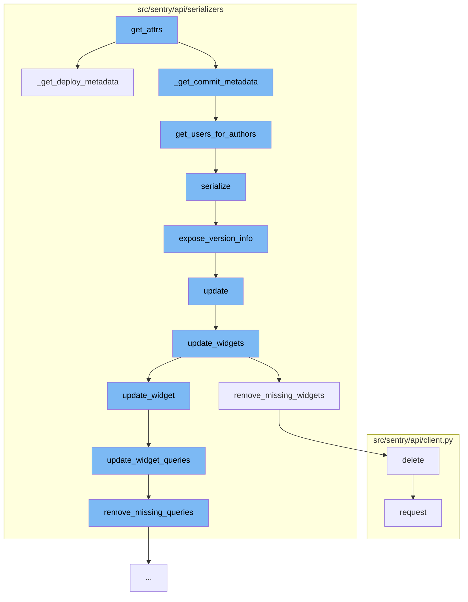

This document will cover the process of handling release metadata in the Sentry application. The process includes:

 1. Getting attributes for a release
 2. Retrieving commit metadata
 3. Getting users for authors
 4. Serializing the release
 5. Exposing version info
 6. Updating the dashboard
 7. Updating widgets on the dashboard
 8. Removing missing widgets
 9. Updating widget queries
10. Removing missing queries
11. Deleting and making a request.



<SwmSnippet path="/src/sentry/api/serializers/models/release.py" line="180">

---

# Getting attributes for a release

The `get_attrs` function starts the process by calling `_get_deploy_metadata` and `_get_commit_metadata`. It retrieves metadata for the release, including commit metadata and deploy metadata.

```python
    def _get_deploy_metadata(self, item_list, user):
        """
        Returns a dictionary of release_id => commit metadata,
        where each commit metadata dict contains commit_count
        and an array of authors.
        e.g.
        {
            1: {
                'latest_commit': <Commit id=1>,
                'authors': [<User id=1>, <User id=2>]
            },
            ...
        }
        """
        deploy_ids = {o.last_deploy_id for o in item_list if o.last_deploy_id}
        if deploy_ids:
            deploy_list = list(Deploy.objects.filter(id__in=deploy_ids))
            deploys = {d.id: c for d, c in zip(deploy_list, serialize(deploy_list, user))}
        else:
            deploys = {}

```

---

</SwmSnippet>

<SwmSnippet path="/src/sentry/api/serializers/models/release.py" line="54">

---

# Retrieving commit metadata

`_get_commit_metadata` function retrieves commit metadata. It calls `get_users_for_authors` to get the users associated with the authors of the commits.

```python
def get_users_for_authors(organization_id, authors, user=None):
    """
    Returns a dictionary of author_id => user, if a Sentry
    user object exists for that email. If there is no matching
    Sentry user, a {user, email} dict representation of that
    author is returned.
    e.g.
    {
        1: serialized(<User id=1>),
        2: {email: 'not-a-user@example.com', name: 'dunno'},
        ...
    }
    """
    results = {}

    fetched = cache.get_many(
        [_user_to_author_cache_key(organization_id, author) for author in authors]
    )
    if fetched:
        missed = []
        for author in authors:
```

---

</SwmSnippet>

<SwmSnippet path="/src/sentry/api/serializers/models/release.py" line="448">

---

# Getting users for authors

`get_users_for_authors` function retrieves the users associated with the authors of the commits. It then calls `serialize` to serialize the release.

```python
    def serialize(self, obj, attrs, user, **kwargs):
        def expose_health_data(data):
            if not data:
                return None
            return {
                "durationP50": data["duration_p50"],
                "durationP90": data["duration_p90"],
                "crashFreeUsers": data["crash_free_users"],
                "crashFreeSessions": data["crash_free_sessions"],
                "sessionsCrashed": data["sessions_crashed"],
                "sessionsErrored": data["sessions_errored"],
                "totalUsers": data["total_users"],
                "totalUsers24h": data["total_users_24h"],
                "totalProjectUsers24h": data["total_project_users_24h"],
                "totalSessions": data["total_sessions"],
                "totalSessions24h": data["total_sessions_24h"],
                "totalProjectSessions24h": data["total_project_sessions_24h"],
                "adoption": data["adoption"],
                "sessionsAdoption": data["sessions_adoption"],
                "stats": data.get("stats"),
                # XXX: legacy key, should be removed later.
```

---

</SwmSnippet>

<SwmSnippet path="/src/sentry/api/serializers/models/release.py" line="26">

---

# Serializing the release

`serialize` function serializes the release. It calls `expose_version_info` to expose the version info of the release.

```python
def expose_version_info(info):
    if info is None:
        return None
    version = {"raw": info["version_raw"]}
    if info["version_parsed"]:
        version.update(
            {
                "major": info["version_parsed"]["major"],
                "minor": info["version_parsed"]["minor"],
                "patch": info["version_parsed"]["patch"],
                "pre": info["version_parsed"]["pre"],
                "buildCode": info["version_parsed"]["build_code"],
                "components": info["version_parsed"]["components"],
            }
        )
    return {
        "package": info["package"],
        "version": version,
        "description": info["description"],
        "buildHash": info["build_hash"],
    }
```

---

</SwmSnippet>

<SwmSnippet path="/src/sentry/api/serializers/rest_framework/dashboard.py" line="329">

---

# Exposing version info

`expose_version_info` function exposes the version info of the release. It then calls `update` to update the dashboard.

```python
    def update(self, instance, validated_data):
        """
        Update a dashboard, the connected widgets and queries

        - Widgets in the dashboard currently, but not in validated_data will be removed.
        - Widgets without ids will be created.
        - Widgets with matching IDs will be updated.
        - The order of the widgets will be updated based on the order in the request data.

        Only call save() on this serializer from within a transaction or
        bad things will happen
        """
        instance.title = validated_data.get("title", instance.title)
        instance.save()

        if "widgets" in validated_data:
            self.update_widgets(instance, validated_data["widgets"])

        return instance
```

---

</SwmSnippet>

<SwmSnippet path="/src/sentry/api/serializers/rest_framework/dashboard.py" line="349">

---

# Updating the dashboard

`update` function updates the dashboard. It calls `update_widgets` to update the widgets on the dashboard.

```python
    def update_widgets(self, instance, widget_data):
        widget_ids = [widget["id"] for widget in widget_data if "id" in widget]

        existing_widgets = DashboardWidget.objects.filter(dashboard=instance, id__in=widget_ids)
        existing_map = {widget.id: widget for widget in existing_widgets}

        # Remove widgets that are not in the current request.
        self.remove_missing_widgets(instance.id, widget_ids)

        # Get new ordering start point to avoid constraint errors
        next_order = get_next_dashboard_order(instance.id)

        for i, data in enumerate(widget_data):
            widget_id = data.get("id")
            if widget_id and widget_id in existing_map:
                # Update existing widget.
                self.update_widget(existing_map[widget_id], data, next_order + i)
            elif not widget_id:
                # Create a new widget.
                self.create_widget(instance, data, next_order + i)
            else:
```

---

</SwmSnippet>

<SwmSnippet path="/src/sentry/api/serializers/rest_framework/dashboard.py" line="374">

---

# Updating widgets on the dashboard

`update_widgets` function updates the widgets on the dashboard. It calls `remove_missing_widgets` to remove any widgets that are not in the current request.

```python
    def remove_missing_widgets(self, dashboard_id, keep_ids):
        """
        Removes current widgets belonging to dashboard not in keep_ids.
```

---

</SwmSnippet>

<SwmSnippet path="/src/sentry/api/serializers/rest_framework/dashboard.py" line="422">

---

# Removing missing widgets

`remove_missing_widgets` function removes any widgets that are not in the current request. It then calls `update_widget_queries` to update the widget queries.

```python
    def update_widget_queries(self, widget, data):
        query_ids = [query["id"] for query in data if "id" in query]
        self.remove_missing_queries(widget.id, query_ids)

        existing = DashboardWidgetQuery.objects.filter(widget=widget, id__in=query_ids)
        existing_map = {query.id: query for query in existing}

        # Get new ordering start point to avoid constraint errors
        next_order = get_next_query_order(widget.id)

        new_queries = []
        for i, query_data in enumerate(data):
            query_id = query_data.get("id")
            if query_id and query_id in existing_map:
                self.update_widget_query(existing_map[query_id], query_data, next_order + i)
            elif not query_id:
                new_queries.append(
                    DashboardWidgetQuery(
                        widget=widget,
                        fields=query_data["fields"],
                        aggregates=query_data.get("aggregates"),
```

---

</SwmSnippet>

<SwmSnippet path="/src/sentry/api/client.py" line="112">

---

# Updating widget queries

`update_widget_queries` function updates the widget queries. It calls `remove_missing_queries` to remove any queries that are not in the current request.

```python
        return self.request("PUT", *args, **kwargs)

    def delete(self, *args, **kwargs):
        return self.request("DELETE", *args, **kwargs)
```

---

</SwmSnippet>

<SwmSnippet path="/src/sentry/api/client.py" line="27">

---

# Removing missing queries

`remove_missing_queries` function removes any queries that are not in the current request. It then calls `delete` and `request` to make a DELETE request.

```python
    def request(
        self,
        method,
        path,
        user=None,
        auth=None,
        params=None,
        data=None,
        is_sudo=None,
        is_superuser=None,
        request=None,
    ):
        if self.prefix not in path:
            full_path = self.prefix + path
        else:
            full_path = path

        # we explicitly do not allow you to override the request *and* the user
        # as then other checks like is_superuser would need overwritten
        assert not (request and (user or auth)), "use either request or auth"

```

---

</SwmSnippet>

&nbsp;

*This is an auto-generated document by Swimm AI 🌊 and has not yet been verified by a human*

<SwmMeta version="3.0.0" repo-id="Z2l0aHViJTNBJTNBZGVtby1zZW50cnklM0ElM0Fzd2ltbWlv" repo-name="demo-sentry"><sup>Powered by [Swimm](/)</sup></SwmMeta>
