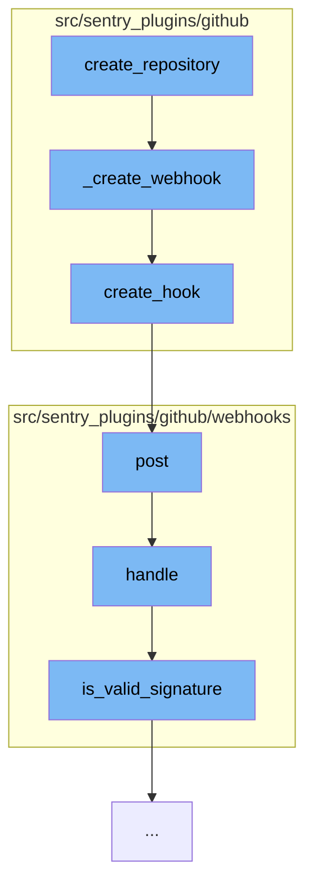

This document will cover the process of creating a repository and setting up a webhook in GitHub via the Sentry GitHub plugin. The process includes the following steps:

1. Creating a repository
2. Creating a webhook for the repository
3. Posting the webhook
4. Handling the webhook request
5. Validating the webhook signature.



<SwmSnippet path="/src/sentry_plugins/github/plugin.py" line="317">

---

# Creating a repository

The `create_repository` function initiates the process by calling the `_create_webhook` function, which is responsible for creating a webhook for the repository.

```python
    def _create_webhook(self, client, organization, repo_name):
        return client.create_hook(repo_name, self._build_webhook_config(organization))
```

---

</SwmSnippet>

<SwmSnippet path="/src/sentry_plugins/github/client.py" line="63">

---

# Creating a webhook for the repository

The `create_hook` function is called by `_create_webhook` to create a webhook for the repository. It does this by making a POST request to the `/repos/{repo}/hooks` endpoint of the GitHub API.

```python
    def create_hook(self, repo, data):
        return self.post(f"/repos/{repo}/hooks", data=data)
```

---

</SwmSnippet>

<SwmSnippet path="/src/sentry_plugins/github/webhooks/integration.py" line="33">

---

# Posting the webhook

The `post` function is called by `create_hook` to handle the request made to the webhook. It does this by calling the `handle` function.

```python
    def post(self, request: Request) -> Response:
        return self.handle(request)
```

---

</SwmSnippet>

<SwmSnippet path="/src/sentry_plugins/github/webhooks/base.py" line="52">

---

# Handling the webhook request

The `handle` function is responsible for handling the webhook request. It first checks if the secret is valid, then it checks if the body of the request is present. If both checks pass, it proceeds to handle the event.

```python
    def handle(self, request: Request, organization=None) -> Response:
        secret = self.get_secret(organization)
        if secret is None:
            logger.info("github.webhook.missing-secret", extra=self.get_logging_data(organization))
            return HttpResponse(status=401)

        body = bytes(request.body)
        if not body:
            logger.error("github.webhook.missing-body", extra=self.get_logging_data(organization))
            return HttpResponse(status=400)

        try:
            handler = self.get_handler(request.META["HTTP_X_GITHUB_EVENT"])
        except KeyError:
            logger.error("github.webhook.missing-event", extra=self.get_logging_data(organization))
            return HttpResponse(status=400)

        if not handler:
            return HttpResponse(status=204)

        try:
```

---

</SwmSnippet>

<SwmSnippet path="/src/sentry_plugins/github/webhooks/base.py" line="31">

---

# Validating the webhook signature

The `is_valid_signature` function is called by `handle` to validate the signature of the webhook. It does this by comparing the expected signature with the received signature.

```python
    def is_valid_signature(self, method, body, secret, signature):
        if method == "sha1":
            mod = hashlib.sha1
        else:
            raise NotImplementedError(f"signature method {method} is not supported")
        expected = hmac.new(key=secret.encode("utf-8"), msg=body, digestmod=mod).hexdigest()
        return constant_time_compare(expected, signature)
```

---

</SwmSnippet>

&nbsp;

*This is an auto-generated document by Swimm AI 🌊 and has not yet been verified by a human*

<SwmMeta version="3.0.0" repo-id="Z2l0aHViJTNBJTNBZGVtby1zZW50cnklM0ElM0Fzd2ltbWlv" repo-name="demo-sentry"><sup>Powered by [Swimm](/)</sup></SwmMeta>
