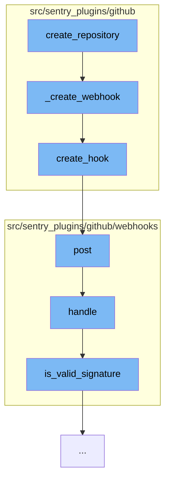

This document will cover the process of creating a repository in GitHub via the Sentry application. The process includes the following steps:

1. Creating a webhook
2. Posting the webhook to GitHub
3. Handling the webhook response
4. Validating the webhook signature.



<SwmSnippet path="/src/sentry_plugins/github/plugin.py" line="317">

---

# Creating a Webhook

The function `_create_webhook` is used to create a new webhook. It uses the `create_hook` method from the GitHub client, passing the repository name and the webhook configuration.

```python
    def _create_webhook(self, client, organization, repo_name):
        return client.create_hook(repo_name, self._build_webhook_config(organization))
```

---

</SwmSnippet>

<SwmSnippet path="/src/sentry_plugins/github/client.py" line="63">

---

# Posting the Webhook to GitHub

The `create_hook` function posts the webhook to the GitHub repository. It uses the `post` method, passing the repository and the data.

```python
    def create_hook(self, repo, data):
        return self.post(f"/repos/{repo}/hooks", data=data)
```

---

</SwmSnippet>

<SwmSnippet path="/src/sentry_plugins/github/webhooks/integration.py" line="33">

---

# Handling the Webhook Response

The `post` function handles the response from GitHub. It uses the `handle` method, passing the request.

```python
    def post(self, request: Request) -> Response:
        return self.handle(request)
```

---

</SwmSnippet>

<SwmSnippet path="/src/sentry_plugins/github/webhooks/base.py" line="52">

---

# Validating the Webhook Signature

The `handle` function validates the webhook signature. It uses the `is_valid_signature` method, passing the method, body, secret, and signature.

```python
    def handle(self, request: Request, organization=None) -> Response:
        secret = self.get_secret(organization)
        if secret is None:
            logger.info("github.webhook.missing-secret", extra=self.get_logging_data(organization))
            return HttpResponse(status=401)

        body = bytes(request.body)
        if not body:
            logger.error("github.webhook.missing-body", extra=self.get_logging_data(organization))
            return HttpResponse(status=400)

        try:
            handler = self.get_handler(request.META["HTTP_X_GITHUB_EVENT"])
        except KeyError:
            logger.error("github.webhook.missing-event", extra=self.get_logging_data(organization))
            return HttpResponse(status=400)

        if not handler:
            return HttpResponse(status=204)

        try:
```

---

</SwmSnippet>

&nbsp;

*This is an auto-generated document by Swimm AI 🌊 and has not yet been verified by a human*

<SwmMeta version="3.0.0" repo-id="Z2l0aHViJTNBJTNBZGVtby1zZW50cnklM0ElM0Fzd2ltbWlv" repo-name="demo-sentry"><sup>Powered by [Swimm](/)</sup></SwmMeta>
