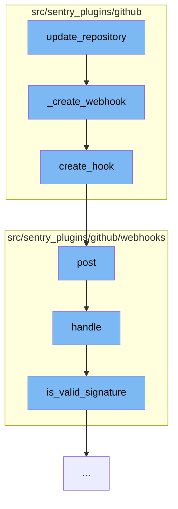

This document will cover the process of updating a repository in the Sentry GitHub plugin, which includes:

1. Creating a webhook
2. Posting the webhook
3. Handling the webhook request
4. Validating the webhook signature.



<SwmSnippet path="/src/sentry_plugins/github/plugin.py" line="317">

---

# Creating a webhook

The function `update_repository` calls `_create_webhook`, which uses the `create_hook` function from the GitHub client to create a new webhook for the repository.

```python
    def _create_webhook(self, client, organization, repo_name):
        return client.create_hook(repo_name, self._build_webhook_config(organization))
```

---

</SwmSnippet>

<SwmSnippet path="/src/sentry_plugins/github/client.py" line="63">

---

# Posting the webhook

`create_hook` makes a POST request to the `/repos/{repo}/hooks` endpoint of the GitHub API, creating a new webhook with the provided data.

```python
    def create_hook(self, repo, data):
        return self.post(f"/repos/{repo}/hooks", data=data)
```

---

</SwmSnippet>

<SwmSnippet path="/src/sentry_plugins/github/webhooks/base.py" line="52">

---

# Handling the webhook request

The `post` function in `integration.py` calls the `handle` function in `base.py`. This function handles the incoming webhook request, validating the request and processing the event.

```python
    def handle(self, request: Request, organization=None) -> Response:
        secret = self.get_secret(organization)
        if secret is None:
            logger.info("github.webhook.missing-secret", extra=self.get_logging_data(organization))
            return HttpResponse(status=401)

        body = bytes(request.body)
        if not body:
            logger.error("github.webhook.missing-body", extra=self.get_logging_data(organization))
            return HttpResponse(status=400)

        try:
            handler = self.get_handler(request.META["HTTP_X_GITHUB_EVENT"])
        except KeyError:
            logger.error("github.webhook.missing-event", extra=self.get_logging_data(organization))
            return HttpResponse(status=400)

        if not handler:
            return HttpResponse(status=204)

        try:
```

---

</SwmSnippet>

<SwmSnippet path="/src/sentry_plugins/github/webhooks/base.py" line="31">

---

# Validating the webhook signature

The `is_valid_signature` function is used to validate the signature of the incoming webhook request. It uses a constant time comparison to prevent timing attacks.

```python
    def is_valid_signature(self, method, body, secret, signature):
        if method == "sha1":
            mod = hashlib.sha1
        else:
            raise NotImplementedError(f"signature method {method} is not supported")
        expected = hmac.new(key=secret.encode("utf-8"), msg=body, digestmod=mod).hexdigest()
        return constant_time_compare(expected, signature)
```

---

</SwmSnippet>

&nbsp;

*This is an auto-generated document by Swimm AI 🌊 and has not yet been verified by a human*

<SwmMeta version="3.0.0" repo-id="Z2l0aHViJTNBJTNBZGVtby1zZW50cnklM0ElM0Fzd2ltbWlv" repo-name="demo-sentry"><sup>Powered by [Swimm](/)</sup></SwmMeta>
