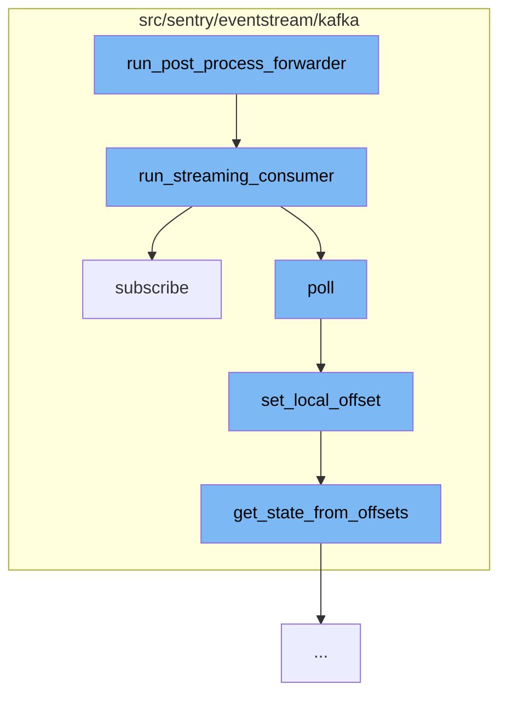

This document will cover the process of running the post process forwarder in the Kafka backend, which includes:

1. Running the streaming consumer
2. Subscribing to a topic
3. Setting the local offset
4. Getting the state from offsets.



<SwmSnippet path="/src/sentry/eventstream/kafka/backend.py" line="262">

---

# Running the streaming consumer

The function `run_streaming_consumer` is the starting point of the flow. It sets up the Kafka consumer, handles partition assignments and revocations, and processes messages from the Kafka topic. It also handles graceful shutdowns.

```python
    def run_streaming_consumer(
        self,
        consumer_group,
        commit_log_topic,
        synchronize_commit_group,
        commit_batch_size=100,
        initial_offset_reset="latest",
    ):
        cluster_name = settings.KAFKA_TOPICS[settings.KAFKA_EVENTS]["cluster"]

        consumer = SynchronizedConsumer(
            cluster_name=cluster_name,
            consumer_group=consumer_group,
            commit_log_topic=commit_log_topic,
            synchronize_commit_group=synchronize_commit_group,
            initial_offset_reset=initial_offset_reset,
        )

        owned_partition_offsets = {}

        def commit(partitions):
```

---

</SwmSnippet>

<SwmSnippet path="/src/sentry/eventstream/kafka/consumer.py" line="270">

---

# Subscribing to a topic

The `subscribe` function is called within `run_streaming_consumer`. It subscribes to a Kafka topic and sets up callbacks for when partitions are assigned or revoked.

```python
    def subscribe(self, topics, on_assign=None, on_revoke=None):
        """
        Subscribe to a topic.
        """
        self.__check_commit_log_consumer_running()

        def assignment_callback(consumer, assignment):
            # Since ``auto.offset.reset`` is set to ``error`` to force human
            # interaction on an offset reset, we have to explicitly specify the
            # starting offset if no offset has been committed for this topic during
            # the ``__consumer_offsets`` topic retention period.
            assignment = {
                (i.topic, i.partition): self.__positions.get((i.topic, i.partition))
                for i in assignment
            }

            for i in self.__consumer.committed(
                [
                    TopicPartition(topic, partition)
                    for (topic, partition), offset in assignment.items()
                    if offset is None
```

---

</SwmSnippet>

<SwmSnippet path="/src/sentry/eventstream/kafka/state.py" line="92">

---

# Setting the local offset

The `set_local_offset` function is called within the `subscribe` function. It updates the local offset for a topic and partition. If this update operation results in a state change, the callback function will be invoked.

```python
    def set_local_offset(self, topic, partition, local_offset):
        """
        Update the local offset for a topic and partition.

        If this update operation results in a state change, the callback
        function will be invoked.
        """
        with self.__lock:
            previous_state, previous_offsets = self.partitions[(topic, partition)]
            if previous_offsets.local is not None and (
                local_offset is None or local_offset < previous_offsets.local
            ):
                logger.info(
                    "Local offset for %s/%s has moved backwards (current: %s, previous: %s)",
                    topic,
                    partition,
                    local_offset,
                    previous_offsets.local,
                )
            updated_offsets = Offsets(local_offset, previous_offsets.remote)
            updated_state = self.get_state_from_offsets(updated_offsets)
```

---

</SwmSnippet>

<SwmSnippet path="/src/sentry/eventstream/kafka/state.py" line="78">

---

# Getting the state from offsets

The `get_state_from_offsets` function is called within `set_local_offset`. It derives the partition state by comparing local and remote offsets.

```python
    def get_state_from_offsets(self, offsets):
        """
        Derive the partition state by comparing local and remote offsets.
        """
        if offsets.local is None or offsets.remote is None:
            return SynchronizedPartitionState.UNKNOWN
        else:
            if offsets.local < offsets.remote:
                return SynchronizedPartitionState.LOCAL_BEHIND
            elif offsets.remote < offsets.local:
                return SynchronizedPartitionState.REMOTE_BEHIND
            else:  # local == remote
                return SynchronizedPartitionState.SYNCHRONIZED
```

---

</SwmSnippet>

&nbsp;

*This is an auto-generated document by Swimm AI 🌊 and has not yet been verified by a human*

<SwmMeta version="3.0.0" repo-id="Z2l0aHViJTNBJTNBZGVtby1zZW50cnklM0ElM0Fzd2ltbWlv" repo-name="demo-sentry"><sup>Powered by [Swimm](/)</sup></SwmMeta>
