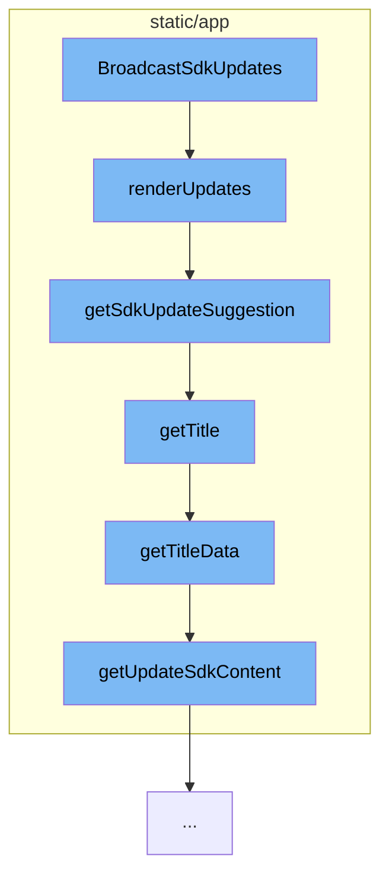

This document will cover the process of broadcasting SDK updates in the demo-sentry project. We'll cover:

1. How the `BroadcastSdkUpdates` function initiates the process
2. How `renderUpdates` function groups SDK updates by project
3. How `getSdkUpdateSuggestion` function generates update suggestions
4. How `getTitle` and `getTitleData` functions generate the title for the update
5. How `getUpdateSdkContent` function generates the content for the update.



<SwmSnippet path="/static/app/components/sidebar/broadcastSdkUpdates.tsx" line="49">

---

# Broadcasting SDK Updates

The `BroadcastSdkUpdates` function initiates the process of broadcasting SDK updates. It calls the `renderUpdates` function which groups SDK updates by project and checks if the user has permission to see the updates. If the user has permission, it maps over the updates and generates the content for each update.

```tsx
  function renderUpdates(projectSdkUpdates: ProjectSdkUpdates[]) {
    // Group SDK updates by project
    const items = Object.entries(groupBy(projectSdkUpdates, 'projectId'));

    return items
      .map(([projectId, updates]) => {
        const project = projects.find(p => p.id === projectId);

        if (!project) {
          return null;
        }

        // Updates should only be shown to users who are project members or users who have open membership or org write permission
        const hasPermissionToSeeUpdates =
          project.isMember ||
          organization.features.includes('open-membership') ||
          organization.access.includes('org:write');

        if (!hasPermissionToSeeUpdates) {
          return null;
        }
```

---

</SwmSnippet>

<SwmSnippet path="/static/app/utils/getSdkUpdateSuggestion.tsx" line="19">

---

# Generating Update Suggestions

The `getSdkUpdateSuggestion` function is called within `renderUpdates` to generate update suggestions. It calls `getTitle` function which in turn calls `getTitleData` to generate the title for the update. It also calls `getUpdateSdkContent` to generate the content for the update.

```tsx
function getSdkUpdateSuggestion({
  sdk,
  suggestion,
  shortStyle = false,
  capitalized = false,
}: Props) {
  function getUpdateSdkContent({newSdkVersion, sdkName}: UpdateSdkSuggestion) {
    if (capitalized) {
      return sdk
        ? shortStyle
          ? tct('Update to [sdk-name]@v[new-sdk-version]', {
              'sdk-name': sdkName,
              'new-sdk-version': newSdkVersion,
            })
          : tct(
              'Update your SDK from [sdk-name]@v[sdk-version] to [sdk-name]@v[new-sdk-version]',
              {
                'sdk-name': sdkName,
                'sdk-version': sdk.version,
                'new-sdk-version': newSdkVersion,
              }
```

---

</SwmSnippet>

&nbsp;

*This is an auto-generated document by Swimm AI 🌊 and has not yet been verified by a human*

<SwmMeta version="3.0.0" repo-id="Z2l0aHViJTNBJTNBZGVtby1zZW50cnklM0ElM0Fzd2ltbWlv" repo-name="demo-sentry"><sup>Powered by [Swimm](/)</sup></SwmMeta>
