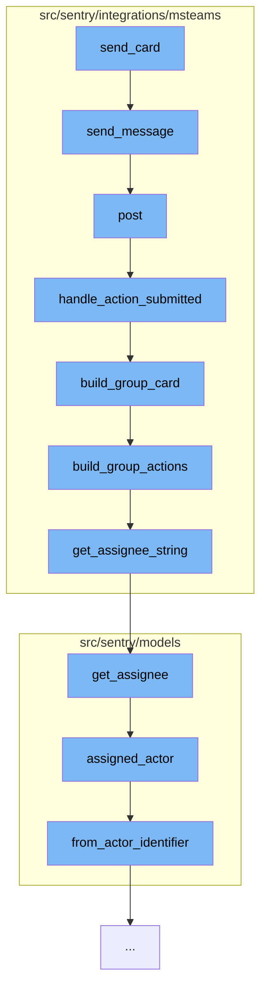

This document will cover the process of sending a card in the Microsoft Teams integration, which includes:

1. Sending the message
2. Posting the message
3. Handling the action submitted
4. Building the group card
5. Building the group actions
6. Getting the assignee string



<SwmSnippet path="/src/sentry/integrations/msteams/client.py" line="44">

---

# Sending the message

The `send_message` function is used to send a message to a specific conversation. It uses the `post` method to send the data to the conversation.

```python
    def send_message(self, conversation_id, data):
        return self.post(self.ACTIVITY_URL % conversation_id, data=data)
```

---

</SwmSnippet>

<SwmSnippet path="/src/sentry/integrations/msteams/webhook.py" line="144">

---

# Posting the message

The `post` function is used to handle the incoming request and verify its signature. Depending on the type of the message, it either handles the action submitted or handles the channel or personal message.

```python
    def post(self, request: Request) -> Response:
        # verify_signature will raise the exception corresponding to the error
        verify_signature(request)

        data = request.data
        conversation_type = data.get("conversation", {}).get("conversationType")

        # only care about conversationUpdate and message
        if data["type"] == "message":
            # the only message events we care about are those which
            # are from a user submitting an option on a card, which
            # will always contain an "payload.actionType" in the data.
            if data.get("value", {}).get("payload", {}).get("actionType"):
                return self.handle_action_submitted(request)
            elif conversation_type == "channel":
                return self.handle_channel_message(request)
            else:
                return self.handle_personal_message(request)
        elif data["type"] == "conversationUpdate":
            channel_data = data["channelData"]
            event = channel_data.get("eventType")
```

---

</SwmSnippet>

<SwmSnippet path="/src/sentry/integrations/msteams/webhook.py" line="322">

---

# Handling the action submitted

The `handle_action_submitted` function is used to handle the action submitted by the user. It extracts the necessary data from the request, verifies the integration and the group, and updates the state of the issue. Finally, it refreshes the issue and updates the card.

```python
    def handle_action_submitted(self, request: Request):
        # pull out parameters
        data = request.data
        channel_data = data["channelData"]
        tenant_id = channel_data["tenant"]["id"]
        payload = data["value"]["payload"]
        group_id = payload["groupId"]
        integration_id = payload["integrationId"]
        user_id = data["from"]["id"]
        activity_id = data["replyToId"]
        conversation = data["conversation"]
        if conversation["conversationType"] == "personal":
            conversation_id = conversation["id"]
        else:
            conversation_id = channel_data["channel"]["id"]

        try:
            integration = Integration.objects.get(id=integration_id)
        except Integration.DoesNotExist:
            logger.info(
                "msteams.action.missing-integration", extra={"integration_id": integration_id}
```

---

</SwmSnippet>

<SwmSnippet path="/src/sentry/integrations/msteams/card_builder.py" line="591">

---

# Building the group card

The `build_group_card` function is used to build the card for the group. It constructs the title, description, footer, assignee note, and actions for the card.

```python
def build_group_card(group, event, rules, integration):
    project = Project.objects.get_from_cache(id=group.project_id)

    title = build_group_title(group)
    body = [title]

    desc = build_group_descr(group)
    if desc:
        body.append(desc)

    footer = build_group_footer(group, rules, project, event)
    body.append(footer)

    assignee_note = build_assignee_note(group)
    if assignee_note:
        body.append(assignee_note)

    actions = build_group_actions(group, event, rules, integration)
    body.append(actions)

    return {
```

---

</SwmSnippet>

<SwmSnippet path="/src/sentry/integrations/msteams/card_builder.py" line="409">

---

# Building the group actions

The `build_group_actions` function is used to build the actions for the group. Depending on the status of the group, it constructs the resolve action, ignore action, and assign action.

```python
def build_group_actions(group, event, rules, integration):
    status = group.get_status()

    if status == GroupStatus.RESOLVED:
        resolve_action = {
            "type": "Action.Submit",
            "title": "Unresolve",
            "data": generate_action_payload(ACTION_TYPE.UNRESOLVE, event, rules, integration),
        }
    else:
        resolve_action = {
            "type": "Action.ShowCard",
            "version": "1.2",
            "title": "Resolve",
            "card": {
                "type": "AdaptiveCard",
                "body": [
                    {"type": "TextBlock", "text": "Resolve", "weight": "Bolder"},
                    {
                        "type": "Input.ChoiceSet",
                        "id": "resolveInput",
```

---

</SwmSnippet>

<SwmSnippet path="/src/sentry/integrations/msteams/card_builder.py" line="33">

---

# Getting the assignee string

The `get_assignee_string` function is used to get a string representation of the group's assignee. It uses the `get_assignee` method of the group to get the assignee and returns the email if the assignee is a user or the slug if the assignee is a team.

```python
def get_assignee_string(group: Group) -> Optional[str]:
    """Get a string representation of the group's assignee."""
    assignee = group.get_assignee()
    if isinstance(assignee, User):
        return assignee.email

    if isinstance(assignee, Team):
        return f"#{assignee.slug}"

    return None
```

---

</SwmSnippet>

&nbsp;

*This is an auto-generated document by Swimm AI 🌊 and has not yet been verified by a human*

<SwmMeta version="3.0.0" repo-id="Z2l0aHViJTNBJTNBZGVtby1zZW50cnklM0ElM0Fzd2ltbWlv" repo-name="demo-sentry"><sup>Powered by [Swimm](/)</sup></SwmMeta>
