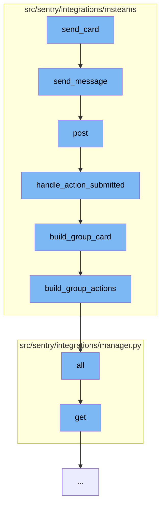

This document will cover the process of sending a card in the Microsoft Teams integration, which includes:

1. Sending a message
2. Posting a request
3. Handling action submission
4. Building a group card
5. Building group actions
6. Managing integrations



<SwmSnippet path="/src/sentry/integrations/msteams/client.py" line="44">

---

# Sending a Message

The `send_message` function is used to send a message to a specific conversation. It does this by making a POST request to the conversation's activity URL with the provided data.

```python
    def send_message(self, conversation_id, data):
        return self.post(self.ACTIVITY_URL % conversation_id, data=data)
```

---

</SwmSnippet>

<SwmSnippet path="/src/sentry/integrations/msteams/webhook.py" line="144">

---

# Posting a Request

The `post` function is used to handle incoming POST requests. It verifies the request's signature, extracts the data, and then handles the request based on its type and content.

```python
    def post(self, request: Request) -> Response:
        # verify_signature will raise the exception corresponding to the error
        verify_signature(request)

        data = request.data
        conversation_type = data.get("conversation", {}).get("conversationType")

        # only care about conversationUpdate and message
        if data["type"] == "message":
            # the only message events we care about are those which
            # are from a user submitting an option on a card, which
            # will always contain an "payload.actionType" in the data.
            if data.get("value", {}).get("payload", {}).get("actionType"):
                return self.handle_action_submitted(request)
            elif conversation_type == "channel":
                return self.handle_channel_message(request)
            else:
                return self.handle_personal_message(request)
        elif data["type"] == "conversationUpdate":
            channel_data = data["channelData"]
            event = channel_data.get("eventType")
```

---

</SwmSnippet>

<SwmSnippet path="/src/sentry/integrations/msteams/webhook.py" line="322">

---

# Handling Action Submission

The `handle_action_submitted` function is used to handle actions submitted from a card. It extracts the necessary parameters from the request, verifies the integration and identity, and then updates the state of the issue and the card.

```python
    def handle_action_submitted(self, request: Request):
        # pull out parameters
        data = request.data
        channel_data = data["channelData"]
        tenant_id = channel_data["tenant"]["id"]
        payload = data["value"]["payload"]
        group_id = payload["groupId"]
        integration_id = payload["integrationId"]
        user_id = data["from"]["id"]
        activity_id = data["replyToId"]
        conversation = data["conversation"]
        if conversation["conversationType"] == "personal":
            conversation_id = conversation["id"]
        else:
            conversation_id = channel_data["channel"]["id"]

        try:
            integration = Integration.objects.get(id=integration_id)
        except Integration.DoesNotExist:
            logger.info(
                "msteams.action.missing-integration", extra={"integration_id": integration_id}
```

---

</SwmSnippet>

<SwmSnippet path="/src/sentry/integrations/msteams/card_builder.py" line="591">

---

# Building a Group Card

The `build_group_card` function is used to build a card for a group. It constructs the card's title, description, footer, and actions, and then returns the card as a dictionary.

```python
def build_group_card(group, event, rules, integration):
    project = Project.objects.get_from_cache(id=group.project_id)

    title = build_group_title(group)
    body = [title]

    desc = build_group_descr(group)
    if desc:
        body.append(desc)

    footer = build_group_footer(group, rules, project, event)
    body.append(footer)

    assignee_note = build_assignee_note(group)
    if assignee_note:
        body.append(assignee_note)

    actions = build_group_actions(group, event, rules, integration)
    body.append(actions)

    return {
```

---

</SwmSnippet>

<SwmSnippet path="/src/sentry/integrations/msteams/card_builder.py" line="409">

---

# Building Group Actions

The `build_group_actions` function is used to build the actions for a group card. It creates actions for resolving, ignoring, and assigning the group, and then returns these actions in a container.

```python
def build_group_actions(group, event, rules, integration):
    status = group.get_status()

    if status == GroupStatus.RESOLVED:
        resolve_action = {
            "type": "Action.Submit",
            "title": "Unresolve",
            "data": generate_action_payload(ACTION_TYPE.UNRESOLVE, event, rules, integration),
        }
    else:
        resolve_action = {
            "type": "Action.ShowCard",
            "version": "1.2",
            "title": "Resolve",
            "card": {
                "type": "AdaptiveCard",
                "body": [
                    {"type": "TextBlock", "text": "Resolve", "weight": "Bolder"},
                    {
                        "type": "Input.ChoiceSet",
                        "id": "resolveInput",
```

---

</SwmSnippet>

<SwmSnippet path="/src/sentry/integrations/manager.py" line="16">

---

# Managing Integrations

The `all` and `get` functions in the `manager.py` file are used to manage integrations. The `all` function returns all visible integrations, while the `get` function returns a specific integration based on its key.

```python
    def all(self):
        for key in self.__values.keys():
            integration = self.get(key)
            if integration.visible:
                yield integration

    def get(self, key, **kwargs):
        try:
            cls = self.__values[key]
        except KeyError:
            raise NotRegistered(key)
        return cls(**kwargs)
```

---

</SwmSnippet>

&nbsp;

*This is an auto-generated document by Swimm AI 🌊 and has not yet been verified by a human*

<SwmMeta version="3.0.0" repo-id="Z2l0aHViJTNBJTNBZGVtby1zZW50cnklM0ElM0Fzd2ltbWlv" repo-name="demo-sentry"><sup>Powered by [Swimm](/)</sup></SwmMeta>
