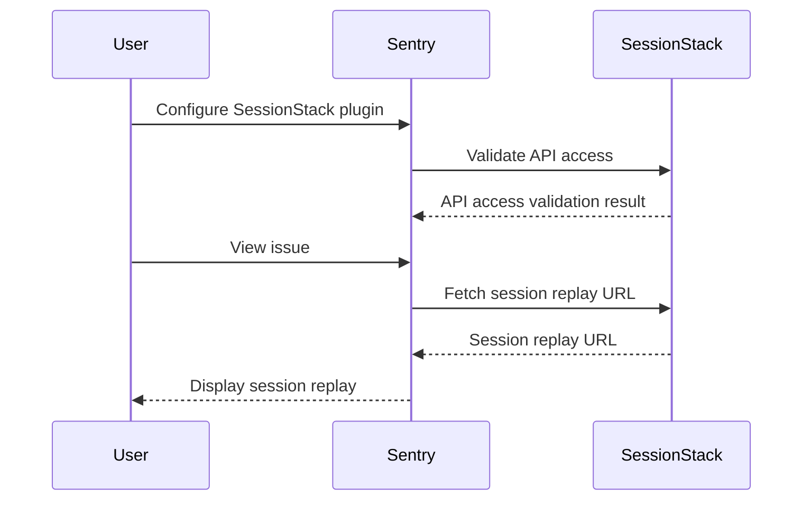

SessionStack is a plugin used in the Sentry application. It allows developers to watch SessionStack recordings in Sentry, providing a more interactive debugging experience. The plugin is defined in the `SessionStackPlugin` class in `src/sentry_plugins/sessionstack/plugin.py`. It requires an account email, API token, and website ID to function. The plugin communicates with the SessionStack API, as defined in `src/sentry_plugins/sessionstack/client.py`, to fetch and manage session data. The SessionStack client validates API access, retrieves session URLs, and manages access tokens for sessions. The plugin is integrated into Sentry's UI, allowing developers to watch session replays directly in the issue details.

<SwmSnippet path="/src/sentry_plugins/sessionstack/plugin.py" line="91">

---

# SessionStack Plugin Configuration

The `get_config` method is used to fetch the current configuration for the SessionStack plugin. This includes the account email, API token, website ID, API URL, and player URL. These details are used to interact with SessionStack's REST API.

```python
    def get_config(self, project, **kwargs):
        account_email = self.get_option("account_email", project)
        api_token = self.get_option("api_token", project)
        website_id = self.get_option("website_id", project)
        api_url = self.get_option("api_url", project)
        player_url = self.get_option("player_url", project)

        configurations = [
            {
                "name": "account_email",
                "label": "Account Email",
                "default": account_email,
                "type": "text",
                "placeholder": 'e.g. "user@example.com"',
                "required": True,
            },
            {
                "name": "api_token",
                "label": "API Token",
                "default": api_token,
                "type": "text",
```

---

</SwmSnippet>

<SwmSnippet path="/src/sentry_plugins/sessionstack/client.py" line="23">

---

# SessionStack API Interaction

The `SessionStackClient` class is used to interact with SessionStack's REST API. It uses the configuration details provided to the SessionStack plugin to make requests to the API. The client can validate API access, fetch session URLs, and manage access tokens.

```python
    def __init__(self, account_email, api_token, website_id, **kwargs):
        self.website_id = website_id

        api_url = kwargs.get("api_url") or API_URL
        self.api_url = remove_trailing_slashes(api_url)

        player_url = kwargs.get("player_url") or PLAYER_URL
        self.player_url = remove_trailing_slashes(player_url)

        self.request_headers = {
            "Authorization": get_basic_auth(account_email, api_token),
            "Content-Type": "application/json",
        }

    def validate_api_access(self):
        website_endpoint = WEBSITES_ENDPOINT.format(self.website_id)

        try:
            response = self._make_request(website_endpoint, "GET")
        except requests.exceptions.ConnectionError:
            raise InvalidApiUrlError
```

---

</SwmSnippet>



&nbsp;

*This is an auto-generated document by Swimm AI 🌊 and has not yet been verified by a human*

<SwmMeta version="3.0.0" repo-id="Z2l0aHViJTNBJTNBZGVtby1zZW50cnklM0ElM0Fzd2ltbWlv" repo-name="demo-sentry"><sup>Powered by [Swimm](/)</sup></SwmMeta>
