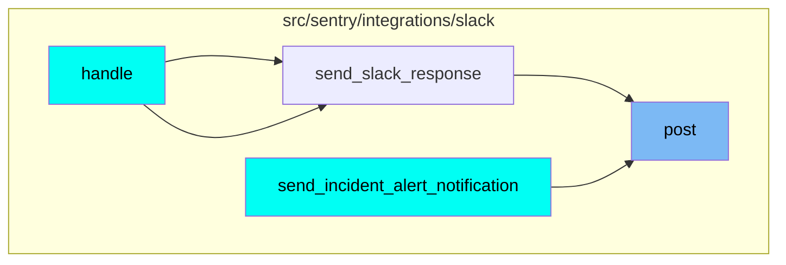
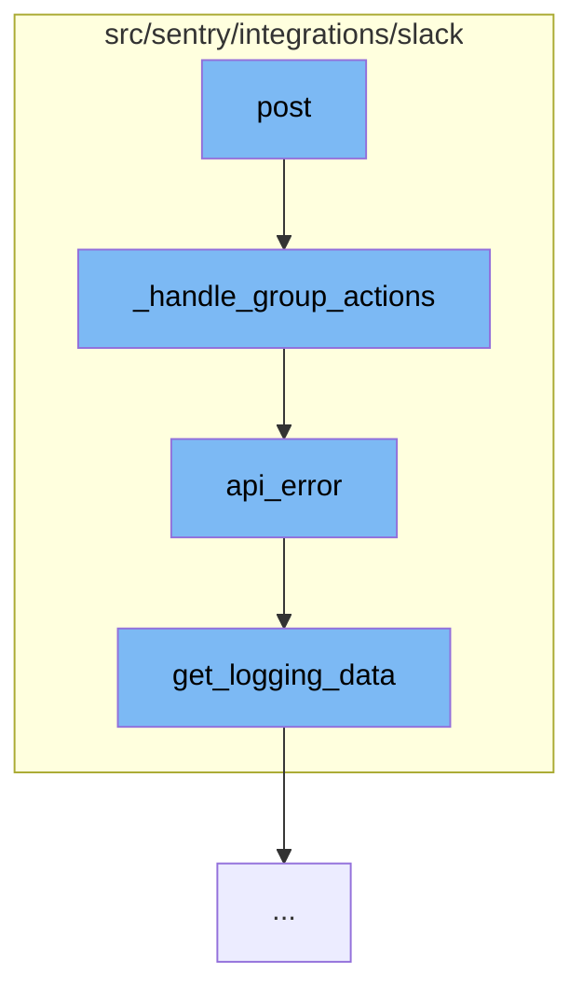

This document will cover the process of handling Slack actions in the Sentry integration, which includes:

1. Handling group actions
2. Handling API errors
3. Logging data for Slack requests.

## Where is this flow used?

The flow starts with the function `post`. It is called from multiple entry points as represented in the following diagram:



## The flow itself



<SwmSnippet path="/src/sentry/integrations/slack/endpoints/action.py" line="256">

---

# Handling Group Actions

The function `_handle_group_actions` is responsible for handling various Slack actions related to a group. It first retrieves the group and the identity of the acting user. Depending on the type of Slack request, it performs different actions such as updating the status, assigning the issue, or opening a resolve dialog. If any of these actions fail, it calls the `api_error` function to handle the error.

```python
    def _handle_group_actions(
        self,
        slack_request: SlackActionRequest,
        request: Request,
        action_list: Sequence[MessageAction],
    ) -> Response:
        group = get_group(slack_request)
        if not group:
            return self.respond(status=403)

        # Determine the acting user by Slack identity.
        try:
            identity = slack_request.get_identity()
        except IdentityProvider.DoesNotExist:
            return self.respond(status=403)

        if not identity:
            associate_url = build_linking_url(
                integration=slack_request.integration,
                slack_id=slack_request.user_id,
                channel_id=slack_request.channel_id,
```

---

</SwmSnippet>

<SwmSnippet path="/src/sentry/integrations/slack/endpoints/action.py" line="132">

---

# Handling API Errors

The function `api_error` is used to handle API errors that occur during the handling of Slack actions. It logs the error and responds with an appropriate message depending on the status code of the error.

```python
    def api_error(
        self,
        slack_request: SlackActionRequest,
        group: Group,
        identity: Identity,
        error: ApiClient.ApiError,
        action_type: str,
    ) -> Response:
        logger.info(
            "slack.action.api-error",
            extra={
                **slack_request.get_logging_data(group),
                "response": str(error.body),
                "action_type": action_type,
            },
        )

        if error.status_code == 403:
            text = UNLINK_IDENTITY_MESSAGE.format(
                associate_url=build_unlinking_url(
                    slack_request.integration.id,
```

---

</SwmSnippet>

<SwmSnippet path="/src/sentry/integrations/slack/requests/action.py" line="60">

---

# Logging Data for Slack Requests

The function `get_logging_data` is used to gather logging data for Slack requests. It includes data such as the response URL and, if a group is provided, the group and organization IDs.

```python
    def get_logging_data(
        self,
        group: Group | None = None,
    ) -> Mapping[str, str | None]:
        logging_data: MutableMapping[str, str | None] = {
            **self.logging_data,
            "response_url": self.response_url,
        }

        if group:
            logging_data.update(
                {
                    "group_id": group.id,
                    "organization_id": group.organization.id,
                }
            )

        return logging_data
```

---

</SwmSnippet>

&nbsp;

*This is an auto-generated document by Swimm AI 🌊 and has not yet been verified by a human*

<SwmMeta version="3.0.0" repo-id="Z2l0aHViJTNBJTNBZGVtby1zZW50cnklM0ElM0Fzd2ltbWlv" repo-name="demo-sentry"><sup>Powered by [Swimm](/)</sup></SwmMeta>
