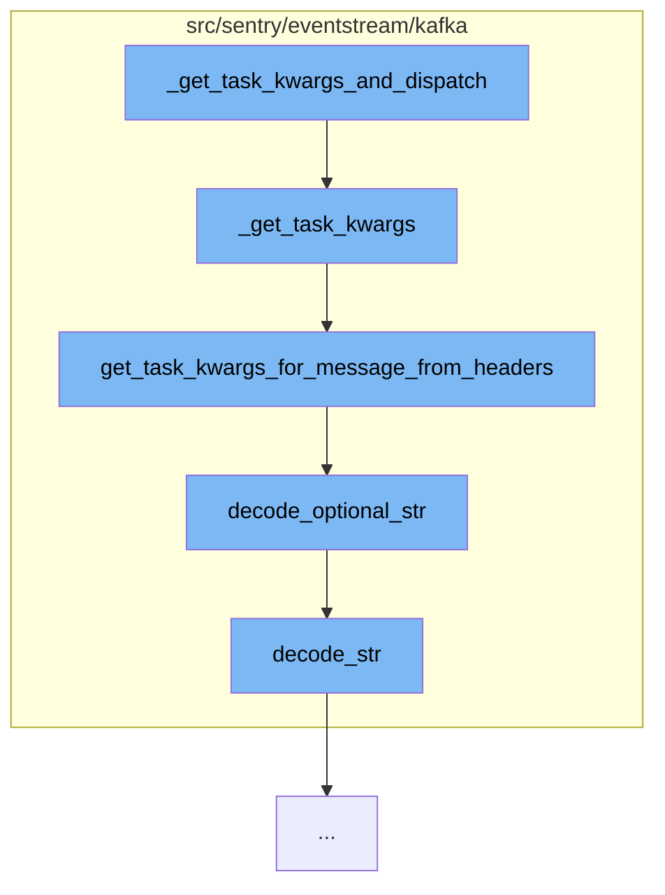

This document will cover the process of dispatching tasks in the Kafka postprocess worker, which includes:

1. Getting task arguments
2. Decoding message headers
3. Dispatching the task



<SwmSnippet path="/src/sentry/eventstream/kafka/postprocessworker.py" line="45">

---

# Getting Task Arguments

The function `_get_task_kwargs` is used to get the arguments for the task. It checks if the `post-process-forwarder:kafka-headers` option is enabled. If it is, it tries to get the task arguments from the message headers. If it fails, or if the option is not enabled, it gets the task arguments from the message value.

```python
def _get_task_kwargs(message: Message) -> Optional[Mapping[str, Any]]:
    use_kafka_headers = options.get("post-process-forwarder:kafka-headers")

    if use_kafka_headers:
        try:
            with _sampled_eventstream_timer(instance="get_task_kwargs_for_message_from_headers"):
                return get_task_kwargs_for_message_from_headers(message.headers())
        except Exception as error:
            logger.error("Could not forward message: %s", error, exc_info=True)
            with metrics.timer(_DURATION_METRIC, instance="get_task_kwargs_for_message"):
                return get_task_kwargs_for_message(message.value())
    else:
        with metrics.timer(_DURATION_METRIC, instance="get_task_kwargs_for_message"):
            return get_task_kwargs_for_message(message.value())
```

---

</SwmSnippet>

<SwmSnippet path="/src/sentry/eventstream/kafka/protocol.py" line="128">

---

# Decoding Message Headers

The function `get_task_kwargs_for_message_from_headers` is used to decode the message headers and get the task arguments. It decodes various fields from the headers, such as `version`, `operation`, `event_id`, `group_id`, `project_id`, `primary_hash`, and various state flags. It then calls the appropriate version handler with the operation, event data, and task state.

```python
def get_task_kwargs_for_message_from_headers(headers: Sequence[Tuple[str, Optional[bytes]]]):
    """
    Same as get_task_kwargs_for_message but gets the required information from
    the kafka message headers.
    """
    try:
        header_data = {k: v for k, v in headers}
        version = decode_int(header_data["version"])
        operation = decode_str(header_data["operation"])

        if operation == "insert":
            if "group_id" not in header_data:
                header_data["group_id"] = None
            if "primary_hash" not in header_data:
                header_data["primary_hash"] = None

            primary_hash = decode_optional_str(header_data["primary_hash"])
            event_id = decode_str(header_data["event_id"])
            group_id = decode_optional_int(header_data["group_id"])
            project_id = decode_int(header_data["project_id"])

```

---

</SwmSnippet>

<SwmSnippet path="/src/sentry/eventstream/kafka/postprocessworker.py" line="1">

---

# Dispatching the Task

The function `_get_task_kwargs_and_dispatch` (not shown in the context) is responsible for getting the task arguments using `_get_task_kwargs` and then dispatching the task with these arguments.

```python
import logging
```

---

</SwmSnippet>

&nbsp;

*This is an auto-generated document by Swimm AI 🌊 and has not yet been verified by a human*

<SwmMeta version="3.0.0" repo-id="Z2l0aHViJTNBJTNBZGVtby1zZW50cnklM0ElM0Fzd2ltbWlv" repo-name="demo-sentry"><sup>Powered by [Swimm](/)</sup></SwmMeta>
