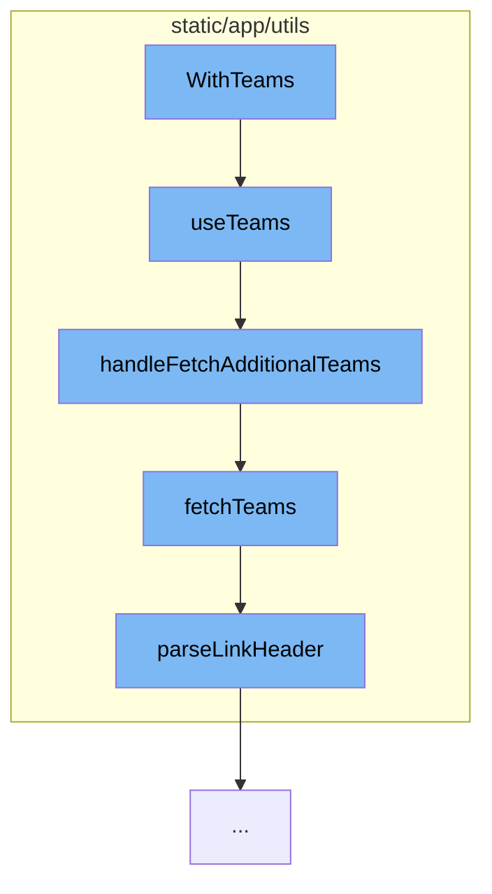

This document will cover the process of team data retrieval and management in the Sentry application. The process includes:

1. Initialization of the `WithTeams` component
2. Utilization of the `useTeams` hook
3. Fetching additional teams with `handleFetchAdditionalTeams`
4. Fetching teams with `fetchTeams`
5. Parsing the link header with `parseLinkHeader`.



<SwmSnippet path="/static/app/utils/withTeams.tsx" line="1">

---

# Initialization of the WithTeams component

The `WithTeams` component is the starting point of the flow. It's a higher-order component that fetches teams and passes them down to the wrapped component. This ensures that the necessary team data is loaded and available for the wrapped component.

```tsx
import * as React from 'react';

import {Team} from 'sentry/types';
import getDisplayName from 'sentry/utils/getDisplayName';
import useTeams from 'sentry/utils/useTeams';

type InjectedTeamsProps = {
  teams?: Team[];
};

```

---

</SwmSnippet>

<SwmSnippet path="/static/app/utils/useTeams.tsx" line="161">

---

# Utilization of the useTeams hook

The `useTeams` hook is used to provide teams from the TeamStore. It also provides a way to select specific slugs to ensure they are loaded, as well as search for more slugs that may not be in the TeamsStore. It's important to note that it is not guaranteed that all teams for an organization will be loaded, so this hook should be used with the intention of providing specific slugs, or loading more through search.

```tsx
function useTeams({limit, slugs, ids, provideUserTeams}: Options = {}) {
  const api = useApi();
  const {organization} = useLegacyStore(OrganizationStore);
  const store = useLegacyStore(TeamStore);

  const orgId = organization?.slug;

  const storeSlugs = new Set(store.teams.map(t => t.slug));
  const slugsToLoad = slugs?.filter(slug => !storeSlugs.has(slug)) ?? [];
  const storeIds = new Set(store.teams.map(t => t.id));
  const idsToLoad = ids?.filter(id => !storeIds.has(id)) ?? [];
  const shouldLoadSlugs = slugsToLoad.length > 0;
  const shouldLoadIds = idsToLoad.length > 0;
  const shouldLoadTeams = provideUserTeams && !store.loadedUserTeams;

  // If we don't need to make a request either for slugs or user teams, set
  // initiallyLoaded to true
  const initiallyLoaded = !shouldLoadSlugs && !shouldLoadTeams && !shouldLoadIds;

  const [state, setState] = useState<State>({
    initiallyLoaded,
```

---

</SwmSnippet>

<SwmSnippet path="/static/app/utils/useTeams.tsx" line="271">

---

# Fetching additional teams with handleFetchAdditionalTeams

`handleFetchAdditionalTeams` is used to fetch additional teams when a search is performed. It uses the store cursor if there is no search keyword provided. If an organization is not in context, it will log an error and return.

```tsx
  async function handleFetchAdditionalTeams(search?: string) {
    const {lastSearch} = state;
    // Use the store cursor if there is no search keyword provided
    const cursor = search ? state.nextCursor : store.cursor;

    if (orgId === undefined) {
      // eslint-disable-next-line no-console
      console.error('Cannot fetch teams without an organization in context');
      return;
    }

    setState({...state, fetching: true});

    try {
      api.clear();
      const {results, hasMore, nextCursor} = await fetchTeams(api, orgId, {
        search,
        limit,
        lastSearch,
        cursor,
      });
```

---

</SwmSnippet>

<SwmSnippet path="/static/app/utils/useTeams.tsx" line="96">

---

# Fetching teams with fetchTeams

`fetchTeams` is a helper function used to load teams. It takes into account various parameters such as slugs, ids, search, limit, lastSearch, and cursor to construct the query for fetching teams.

```tsx
async function fetchTeams(
  api: Client,
  orgId: string,
  {slugs, ids, search, limit, lastSearch, cursor}: FetchTeamOptions = {}
) {
  const query: {
    cursor?: typeof cursor;
    per_page?: number;
    query?: string;
  } = {};

  if (slugs !== undefined && slugs.length > 0) {
    query.query = slugs.map(slug => `slug:${slug}`).join(' ');
  }

  if (ids !== undefined && ids.length > 0) {
    query.query = ids.map(id => `id:${id}`).join(' ');
  }

  if (search) {
    query.query = `${query.query ?? ''} ${search}`.trim();
```

---

</SwmSnippet>

<SwmSnippet path="/static/app/utils/parseLinkHeader.tsx" line="3">

---

# Parsing the link header with parseLinkHeader

`parseLinkHeader` is used to parse the Link header from the response of the fetchTeams API call. It returns an object with the parsed links.

```tsx
export default function parseLinkHeader(header: string | null): Result {
  if (header === null || header === '') {
    return {};
  }

  const headerValues = header.split(',');
  const links = {};

  headerValues.forEach(val => {
    const match =
      /<([^>]+)>; rel="([^"]+)"(?:; results="([^"]+)")?(?:; cursor="([^"]+)")?/g.exec(
        val
      );
    const hasResults = match![3] === 'true' ? true : match![3] === 'false' ? false : null;

    links[match![2]] = {
      href: match![1],
      results: hasResults,
      cursor: match![4],
    };
  });
```

---

</SwmSnippet>

&nbsp;

*This is an auto-generated document by Swimm AI 🌊 and has not yet been verified by a human*

<SwmMeta version="3.0.0" repo-id="Z2l0aHViJTNBJTNBZGVtby1zZW50cnklM0ElM0Fzd2ltbWlv" repo-name="demo-sentry"><sup>Powered by [Swimm](/)</sup></SwmMeta>
