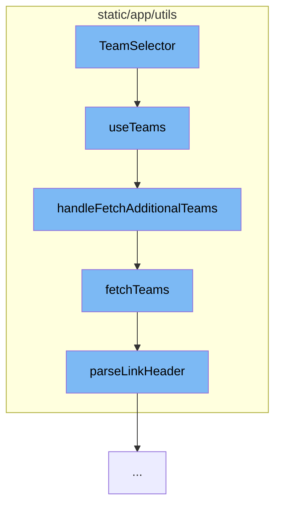

This document will cover the process of team selection in the Sentry application, which includes:

1. The use of the TeamSelector component
2. The use of the useTeams hook
3. Fetching additional teams
4. Fetching teams
5. Parsing the Link Header



<SwmSnippet path="/static/app/components/forms/teamSelector.tsx" line="1">

---

# The use of the TeamSelector component

The TeamSelector component is the starting point of this flow. It is responsible for allowing the user to select a team from a list of available teams.

```tsx
import {useRef} from 'react';
import {StylesConfig} from 'react-select';
import styled from '@emotion/styled';
import debounce from 'lodash/debounce';

import {addTeamToProject} from 'sentry/actionCreators/projects';
import Button from 'sentry/components/button';
import SelectControl, {ControlProps} from 'sentry/components/forms/selectControl';
import IdBadge from 'sentry/components/idBadge';
import Tooltip from 'sentry/components/tooltip';
```

---

</SwmSnippet>

<SwmSnippet path="/static/app/utils/useTeams.tsx" line="161">

---

# The use of the useTeams hook

The useTeams hook is used by the TeamSelector component to fetch the teams from the TeamStore. It provides a way to select specific slugs to ensure they are loaded, as well as search for more slugs that may not be in the TeamsStore.

```tsx
function useTeams({limit, slugs, ids, provideUserTeams}: Options = {}) {
  const api = useApi();
  const {organization} = useLegacyStore(OrganizationStore);
  const store = useLegacyStore(TeamStore);

  const orgId = organization?.slug;

  const storeSlugs = new Set(store.teams.map(t => t.slug));
  const slugsToLoad = slugs?.filter(slug => !storeSlugs.has(slug)) ?? [];
  const storeIds = new Set(store.teams.map(t => t.id));
  const idsToLoad = ids?.filter(id => !storeIds.has(id)) ?? [];
  const shouldLoadSlugs = slugsToLoad.length > 0;
  const shouldLoadIds = idsToLoad.length > 0;
  const shouldLoadTeams = provideUserTeams && !store.loadedUserTeams;

  // If we don't need to make a request either for slugs or user teams, set
  // initiallyLoaded to true
  const initiallyLoaded = !shouldLoadSlugs && !shouldLoadTeams && !shouldLoadIds;

  const [state, setState] = useState<State>({
    initiallyLoaded,
```

---

</SwmSnippet>

<SwmSnippet path="/static/app/utils/useTeams.tsx" line="271">

---

# Fetching additional teams

The handleFetchAdditionalTeams function is used to fetch additional teams when the user searches for a team that is not already loaded in the TeamsStore.

```tsx
  async function handleFetchAdditionalTeams(search?: string) {
    const {lastSearch} = state;
    // Use the store cursor if there is no search keyword provided
    const cursor = search ? state.nextCursor : store.cursor;

    if (orgId === undefined) {
      // eslint-disable-next-line no-console
      console.error('Cannot fetch teams without an organization in context');
      return;
    }

    setState({...state, fetching: true});

    try {
      api.clear();
      const {results, hasMore, nextCursor} = await fetchTeams(api, orgId, {
        search,
        limit,
        lastSearch,
        cursor,
      });
```

---

</SwmSnippet>

<SwmSnippet path="/static/app/utils/useTeams.tsx" line="96">

---

# Fetching teams

The fetchTeams function is used to fetch teams from the API. It is used by both the useTeams hook and the handleFetchAdditionalTeams function.

```tsx
async function fetchTeams(
  api: Client,
  orgId: string,
  {slugs, ids, search, limit, lastSearch, cursor}: FetchTeamOptions = {}
) {
  const query: {
    cursor?: typeof cursor;
    per_page?: number;
    query?: string;
  } = {};

  if (slugs !== undefined && slugs.length > 0) {
    query.query = slugs.map(slug => `slug:${slug}`).join(' ');
  }

  if (ids !== undefined && ids.length > 0) {
    query.query = ids.map(id => `id:${id}`).join(' ');
  }

  if (search) {
    query.query = `${query.query ?? ''} ${search}`.trim();
```

---

</SwmSnippet>

<SwmSnippet path="/static/app/utils/parseLinkHeader.tsx" line="3">

---

# Parsing the Link Header

The parseLinkHeader function is used to parse the Link header from the API response. This is used to handle pagination of the teams.

```tsx
export default function parseLinkHeader(header: string | null): Result {
  if (header === null || header === '') {
    return {};
  }

  const headerValues = header.split(',');
  const links = {};

  headerValues.forEach(val => {
    const match =
      /<([^>]+)>; rel="([^"]+)"(?:; results="([^"]+)")?(?:; cursor="([^"]+)")?/g.exec(
        val
      );
    const hasResults = match![3] === 'true' ? true : match![3] === 'false' ? false : null;

    links[match![2]] = {
      href: match![1],
      results: hasResults,
      cursor: match![4],
    };
  });
```

---

</SwmSnippet>

&nbsp;

*This is an auto-generated document by Swimm AI 🌊 and has not yet been verified by a human*

<SwmMeta version="3.0.0" repo-id="Z2l0aHViJTNBJTNBZGVtby1zZW50cnklM0ElM0Fzd2ltbWlv" repo-name="demo-sentry"><sup>Powered by [Swimm](/)</sup></SwmMeta>
