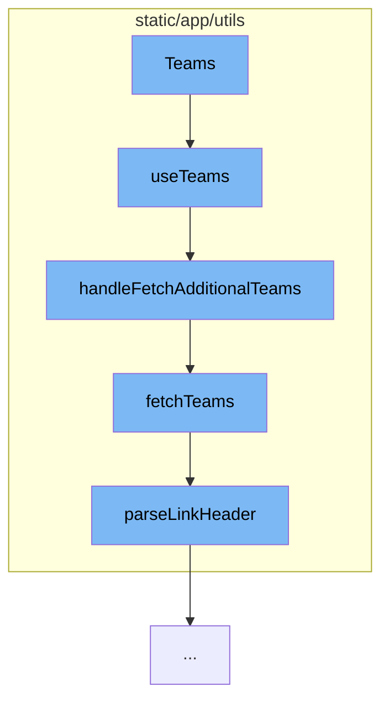

This document will cover the process of fetching and managing teams in the Sentry application. The main points covered are:

1. The use of the `useTeams` function
2. The role of `handleFetchAdditionalTeams` function
3. The purpose of `fetchTeams` function
4. The utility of `parseLinkHeader` function.



<SwmSnippet path="/static/app/utils/useTeams.tsx" line="161">

---

# The use of the `useTeams` function

The `useTeams` function is a hook that provides teams from the TeamStore. It also provides a way to select specific slugs to ensure they are loaded, as well as search (type-ahead) for more slugs that may not be in the TeamsStore. It is important to note that it is not guaranteed that all teams for an organization will be loaded, so this hook should be used with the intention of providing specific slugs, or loading more through search.

```tsx
function useTeams({limit, slugs, ids, provideUserTeams}: Options = {}) {
  const api = useApi();
  const {organization} = useLegacyStore(OrganizationStore);
  const store = useLegacyStore(TeamStore);

  const orgId = organization?.slug;

  const storeSlugs = new Set(store.teams.map(t => t.slug));
  const slugsToLoad = slugs?.filter(slug => !storeSlugs.has(slug)) ?? [];
  const storeIds = new Set(store.teams.map(t => t.id));
  const idsToLoad = ids?.filter(id => !storeIds.has(id)) ?? [];
  const shouldLoadSlugs = slugsToLoad.length > 0;
  const shouldLoadIds = idsToLoad.length > 0;
  const shouldLoadTeams = provideUserTeams && !store.loadedUserTeams;

  // If we don't need to make a request either for slugs or user teams, set
  // initiallyLoaded to true
  const initiallyLoaded = !shouldLoadSlugs && !shouldLoadTeams && !shouldLoadIds;

  const [state, setState] = useState<State>({
    initiallyLoaded,
```

---

</SwmSnippet>

<SwmSnippet path="/static/app/utils/useTeams.tsx" line="271">

---

# The role of `handleFetchAdditionalTeams` function

The `handleFetchAdditionalTeams` function is used to fetch additional teams based on a search query. If there is no search keyword provided, it uses the store cursor. It updates the state to indicate fetching and then calls the `fetchTeams` function. If the fetch is successful, it updates the teams in the store and the state. If there is an error, it updates the state to indicate the error.

```tsx
  async function handleFetchAdditionalTeams(search?: string) {
    const {lastSearch} = state;
    // Use the store cursor if there is no search keyword provided
    const cursor = search ? state.nextCursor : store.cursor;

    if (orgId === undefined) {
      // eslint-disable-next-line no-console
      console.error('Cannot fetch teams without an organization in context');
      return;
    }

    setState({...state, fetching: true});

    try {
      api.clear();
      const {results, hasMore, nextCursor} = await fetchTeams(api, orgId, {
        search,
        limit,
        lastSearch,
        cursor,
      });
```

---

</SwmSnippet>

<SwmSnippet path="/static/app/utils/useTeams.tsx" line="96">

---

# The purpose of `fetchTeams` function

The `fetchTeams` function is a helper function to load teams. It takes in parameters such as slugs, ids, search, limit, lastSearch, and cursor to construct a query to fetch teams. It then makes an API request to fetch the teams. It also parses the Link header in the response to determine if there are more teams to fetch.

```tsx
async function fetchTeams(
  api: Client,
  orgId: string,
  {slugs, ids, search, limit, lastSearch, cursor}: FetchTeamOptions = {}
) {
  const query: {
    cursor?: typeof cursor;
    per_page?: number;
    query?: string;
  } = {};

  if (slugs !== undefined && slugs.length > 0) {
    query.query = slugs.map(slug => `slug:${slug}`).join(' ');
  }

  if (ids !== undefined && ids.length > 0) {
    query.query = ids.map(id => `id:${id}`).join(' ');
  }

  if (search) {
    query.query = `${query.query ?? ''} ${search}`.trim();
```

---

</SwmSnippet>

<SwmSnippet path="/static/app/utils/parseLinkHeader.tsx" line="3">

---

# The utility of `parseLinkHeader` function

The `parseLinkHeader` function is used to parse the Link header in the response of the `fetchTeams` function. It splits the header by commas and then extracts the href, results, and cursor for each link. It returns an object with these values for each link.

```tsx
export default function parseLinkHeader(header: string | null): Result {
  if (header === null || header === '') {
    return {};
  }

  const headerValues = header.split(',');
  const links = {};

  headerValues.forEach(val => {
    const match =
      /<([^>]+)>; rel="([^"]+)"(?:; results="([^"]+)")?(?:; cursor="([^"]+)")?/g.exec(
        val
      );
    const hasResults = match![3] === 'true' ? true : match![3] === 'false' ? false : null;

    links[match![2]] = {
      href: match![1],
      results: hasResults,
      cursor: match![4],
    };
  });
```

---

</SwmSnippet>

&nbsp;

*This is an auto-generated document by Swimm AI 🌊 and has not yet been verified by a human*

<SwmMeta version="3.0.0" repo-id="Z2l0aHViJTNBJTNBZGVtby1zZW50cnklM0ElM0Fzd2ltbWlv" repo-name="demo-sentry"><sup>Powered by [Swimm](/)</sup></SwmMeta>
