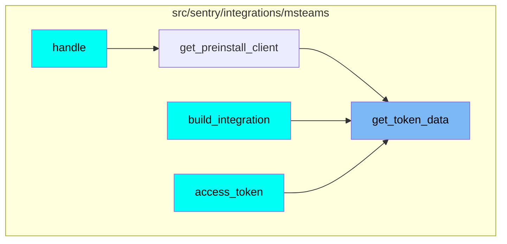
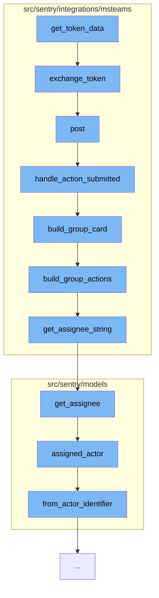

This document will cover the process of token exchange and message handling in the Microsoft Teams integration. The steps include:

1. Token exchange
2. Posting a message
3. Handling action submission
4. Building a group card
5. Building group actions
6. Assigning a group

## Where is this flow used?

The flow starts with the function `get_token_data`. It is called from multiple entry points as represented in the following diagram:



## The flow itself



<SwmSnippet path="/src/sentry/integrations/msteams/client.py" line="118">

---

# Token Exchange

The `exchange_token` function is used to exchange a token for client credentials. This is the first step in the process.

```python
    def exchange_token(self):
        headers = {"Content-Type": "application/x-www-form-urlencoded"}
        data = {
            "client_id": self.client_id,
            "client_secret": self.client_secret,
            "grant_type": "client_credentials",
            "scope": "https://api.botframework.com/.default",
        }
        return self.post(self.TOKEN_URL, data=urlencode(data), headers=headers, json=False)
```

---

</SwmSnippet>

<SwmSnippet path="/src/sentry/integrations/msteams/webhook.py" line="144">

---

# Posting a Message

The `post` function is used to post a message. It verifies the signature of the request and handles different types of messages based on their content.

```python
    def post(self, request: Request) -> Response:
        # verify_signature will raise the exception corresponding to the error
        verify_signature(request)

        data = request.data
        conversation_type = data.get("conversation", {}).get("conversationType")

        # only care about conversationUpdate and message
        if data["type"] == "message":
            # the only message events we care about are those which
            # are from a user submitting an option on a card, which
            # will always contain an "payload.actionType" in the data.
            if data.get("value", {}).get("payload", {}).get("actionType"):
                return self.handle_action_submitted(request)
            elif conversation_type == "channel":
                return self.handle_channel_message(request)
            else:
                return self.handle_personal_message(request)
        elif data["type"] == "conversationUpdate":
            channel_data = data["channelData"]
            event = channel_data.get("eventType")
```

---

</SwmSnippet>

<SwmSnippet path="/src/sentry/integrations/msteams/webhook.py" line="322">

---

# Handling Action Submission

The `handle_action_submitted` function is used to handle the submission of an action. It extracts necessary data from the request, validates the integration and group, and updates the state of the issue.

```python
    def handle_action_submitted(self, request: Request):
        # pull out parameters
        data = request.data
        channel_data = data["channelData"]
        tenant_id = channel_data["tenant"]["id"]
        payload = data["value"]["payload"]
        group_id = payload["groupId"]
        integration_id = payload["integrationId"]
        user_id = data["from"]["id"]
        activity_id = data["replyToId"]
        conversation = data["conversation"]
        if conversation["conversationType"] == "personal":
            conversation_id = conversation["id"]
        else:
            conversation_id = channel_data["channel"]["id"]

        try:
            integration = Integration.objects.get(id=integration_id)
        except Integration.DoesNotExist:
            logger.info(
                "msteams.action.missing-integration", extra={"integration_id": integration_id}
```

---

</SwmSnippet>

<SwmSnippet path="/src/sentry/integrations/msteams/card_builder.py" line="591">

---

# Building a Group Card

The `build_group_card` function is used to build a card for a group. It constructs the card with a title, description, footer, assignee note, and actions.

```python
def build_group_card(group, event, rules, integration):
    project = Project.objects.get_from_cache(id=group.project_id)

    title = build_group_title(group)
    body = [title]

    desc = build_group_descr(group)
    if desc:
        body.append(desc)

    footer = build_group_footer(group, rules, project, event)
    body.append(footer)

    assignee_note = build_assignee_note(group)
    if assignee_note:
        body.append(assignee_note)

    actions = build_group_actions(group, event, rules, integration)
    body.append(actions)

    return {
```

---

</SwmSnippet>

<SwmSnippet path="/src/sentry/integrations/msteams/card_builder.py" line="409">

---

# Building Group Actions

The `build_group_actions` function is used to build actions for a group. It creates actions based on the group's status and assignee.

```python
def build_group_actions(group, event, rules, integration):
    status = group.get_status()

    if status == GroupStatus.RESOLVED:
        resolve_action = {
            "type": "Action.Submit",
            "title": "Unresolve",
            "data": generate_action_payload(ACTION_TYPE.UNRESOLVE, event, rules, integration),
        }
    else:
        resolve_action = {
            "type": "Action.ShowCard",
            "version": "1.2",
            "title": "Resolve",
            "card": {
                "type": "AdaptiveCard",
                "body": [
                    {"type": "TextBlock", "text": "Resolve", "weight": "Bolder"},
                    {
                        "type": "Input.ChoiceSet",
                        "id": "resolveInput",
```

---

</SwmSnippet>

<SwmSnippet path="/src/sentry/integrations/msteams/card_builder.py" line="33">

---

# Assigning a Group

The `get_assignee_string` function is used to get a string representation of the group's assignee. This is used in the process of assigning a group.

```python
def get_assignee_string(group: Group) -> Optional[str]:
    """Get a string representation of the group's assignee."""
    assignee = group.get_assignee()
    if isinstance(assignee, User):
        return assignee.email

    if isinstance(assignee, Team):
        return f"#{assignee.slug}"

    return None
```

---

</SwmSnippet>

&nbsp;

*This is an auto-generated document by Swimm AI 🌊 and has not yet been verified by a human*

<SwmMeta version="3.0.0" repo-id="Z2l0aHViJTNBJTNBZGVtby1zZW50cnklM0ElM0Fzd2ltbWlv" repo-name="demo-sentry"><sup>Powered by [Swimm](/)</sup></SwmMeta>
