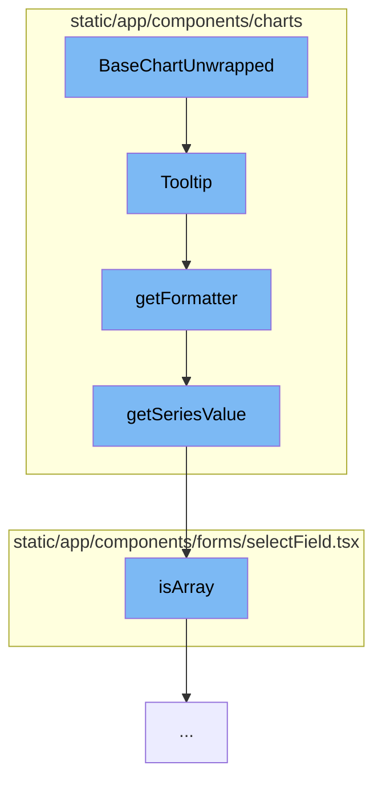

This document will cover the process of generating a tooltip for a chart in the Sentry application. The process includes the following steps:

1. Initialization of the BaseChartUnwrapped component
2. Creation of the Tooltip component
3. Generation of the tooltip formatter
4. Retrieval of the series value
5. Validation of the series value type.



<SwmSnippet path="/static/app/components/charts/baseChart.tsx" line="1">

---

# Initialization of the BaseChartUnwrapped component

The `BaseChartUnwrapped` component is the starting point of the tooltip generation process. It is responsible for rendering the base chart where the tooltip will be displayed.

```tsx
import 'echarts/lib/component/grid';
import 'echarts/lib/component/graphic';
import 'echarts/lib/component/toolbox';
import 'zrender/lib/svg/svg';

import {forwardRef, useMemo} from 'react';
import {useTheme} from '@emotion/react';
import styled from '@emotion/styled';
import type {
  AxisPointerComponentOption,
  ECharts,
  EChartsOption,
  GridComponentOption,
  LegendComponentOption,
  LineSeriesOption,
  SeriesOption,
  TooltipComponentFormatterCallback,
  TooltipComponentFormatterCallbackParams,
  TooltipComponentOption,
  VisualMapComponentOption,
  XAXisComponentOption,
```

---

</SwmSnippet>

<SwmSnippet path="/static/app/components/charts/components/tooltip.tsx" line="237">

---

# Creation of the Tooltip component

The `Tooltip` function is responsible for creating the tooltip component. It takes in various properties and returns a `TooltipComponentOption` object. This object includes properties such as `show`, `trigger`, `backgroundColor`, `borderWidth`, `extraCssText`, `transitionDuration`, `padding`, `className`, `hideDelay`, `position`, and `formatter`.

```tsx
export default function Tooltip({
  filter,
  isGroupedByDate,
  showTimeInTooltip,
  addSecondsToTimeFormat,
  formatter,
  truncate,
  utc,
  bucketSize,
  formatAxisLabel,
  valueFormatter,
  nameFormatter,
  markerFormatter,
  hideDelay,
  indentLabels,
  ...props
}: Props = {}): TooltipComponentOption {
  const theme = useTheme();

  formatter =
    formatter ||
```

---

</SwmSnippet>

<SwmSnippet path="/static/app/components/charts/components/tooltip.tsx" line="104">

---

# Generation of the tooltip formatter

The `getFormatter` function is used to generate the formatter for the tooltip. The formatter is a function that takes in the series parameters and returns a formatted string that will be displayed in the tooltip.

```tsx
function getFormatter({
  filter,
  isGroupedByDate,
  showTimeInTooltip,
  truncate,
  formatAxisLabel,
  utc,
  bucketSize,
  valueFormatter = defaultValueFormatter,
  nameFormatter = defaultNameFormatter,
  markerFormatter = defaultMarkerFormatter,
  indentLabels = [],
  addSecondsToTimeFormat = false,
}: FormatterOptions) {
  const getFilter = (seriesParam: any) => {
    // Series do not necessarily have `data` defined, e.g. releases don't have `data`, but rather
    // has a series using strictly `markLine`s.
    // However, real series will have `data` as a tuple of (label, value) or be
    // an object with value/label keys.
    const value = getSeriesValue(seriesParam, 0);
    if (typeof filter === 'function') {
```

---

</SwmSnippet>

<SwmSnippet path="/static/app/components/charts/components/tooltip.tsx" line="68">

---

# Retrieval of the series value

The `getSeriesValue` function is used to retrieve the value of the series from the series parameters. This value is used in the tooltip formatter to display the value of the series in the tooltip.

```tsx
function getSeriesValue(series: any, offset: number) {
  if (!series.data) {
    return undefined;
  }
  if (Array.isArray(series.data)) {
    return series.data[offset];
  }
  if (Array.isArray(series.data.value)) {
    return series.data.value[offset];
  }

  return undefined;
}
```

---

</SwmSnippet>

<SwmSnippet path="/static/app/components/forms/selectField.tsx" line="51">

---

# Validation of the series value type

The `isArray` function is used to validate if the series value is an array. This is important as the series value can either be a single value or an array of values.

```tsx
/**
 * Required to type guard for OptionsType<T> which is a readonly Array
 */
function isArray<T>(maybe: T | OptionsType<T>): maybe is OptionsType<T> {
  return Array.isArray(maybe);
}
```

---

</SwmSnippet>

&nbsp;

*This is an auto-generated document by Swimm AI 🌊 and has not yet been verified by a human*

<SwmMeta version="3.0.0" repo-id="Z2l0aHViJTNBJTNBZGVtby1zZW50cnklM0ElM0Fzd2ltbWlv" repo-name="demo-sentry"><sup>Powered by [Swimm](/)</sup></SwmMeta>
