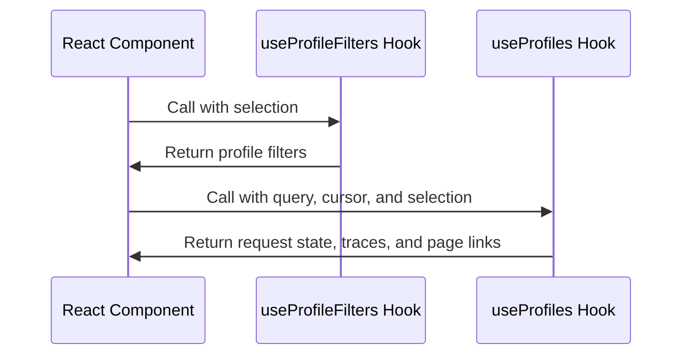

In the context of the demo-sentry repository, Hooks are a feature of React, a JavaScript library for building user interfaces. Hooks allow you to use state and other React features without writing a class. They are functions that let you 'hook into' React state and lifecycle features from function components. In the provided code, `useEffect` and `useState` are examples of Hooks. `useEffect` is used to perform side effects in function components, and it's similar to `componentDidMount` and `componentDidUpdate` in class components. `useState` is a Hook that lets you add React state to function components. In the provided code, `useState` is used to declare a state variable `profileFilters` and `requestState`.

<SwmSnippet path="/static/app/utils/profiling/hooks/useProfileFilters.tsx" line="11">

---

# useProfileFilters Hook

The `useProfileFilters` hook fetches profile filters from the server and provides them for use in the component. It uses the `useApi` hook to get an API client and the `useOrganization` hook to get the current organization. The hook fetches the profile filters when the `selection` changes and cleans up by clearing the API client when the component unmounts.

```tsx
function useProfileFilters(selection: PageFilters | undefined): ProfileFilters {
  const api = useApi();
  const organization = useOrganization();

  const [profileFilters, setProfileFilters] = useState<ProfileFilters>({});

  useEffect(() => {
    if (!selection) {
      return undefined;
    }

    fetchProfileFilters(api, organization, selection).then(response => {
      const withPredefinedFilters = response.reduce(
        (filters: ProfileFilters, tag: Tag) => {
          filters[tag.key] = {
            ...tag,
            // predefined allows us to specify a list of possible values
            predefined: true,
          };
          return filters;
        },
```

---

</SwmSnippet>

<SwmSnippet path="/static/app/utils/profiling/hooks/useProfiles.tsx" line="38">

---

# useProfiles Hook

The `useProfiles` hook fetches profiling data (traces) from the server and manages the state of the request. It uses the `useApi` hook to get an API client and the `useOrganization` hook to get the current organization. The hook fetches the traces when the `query`, `cursor`, or `selection` changes and cleans up by clearing the API client when the component unmounts.

```tsx
function useProfiles({
  cursor,
  query,
  selection,
}: UseProfilesOptions): [RequestState, Trace[], string | null] {
  const api = useApi();
  const organization = useOrganization();

  const [requestState, setRequestState] = useState<RequestState>('initial');
  const [traces, setTraces] = useState<Trace[]>([]);
  const [pageLinks, setPageLinks] = useState<string | null>(null);

  useEffect(() => {
    if (selection === undefined) {
      return undefined;
    }

    setRequestState('loading');

    fetchTraces(api, query, cursor, organization, selection)
      .then(([_traces, , response]) => {
```

---

</SwmSnippet>



&nbsp;

*This is an auto-generated document by Swimm AI 🌊 and has not yet been verified by a human*

<SwmMeta version="3.0.0" repo-id="Z2l0aHViJTNBJTNBZGVtby1zZW50cnklM0ElM0Fzd2ltbWlv" repo-name="demo-sentry"><sup>Powered by [Swimm](/)</sup></SwmMeta>
