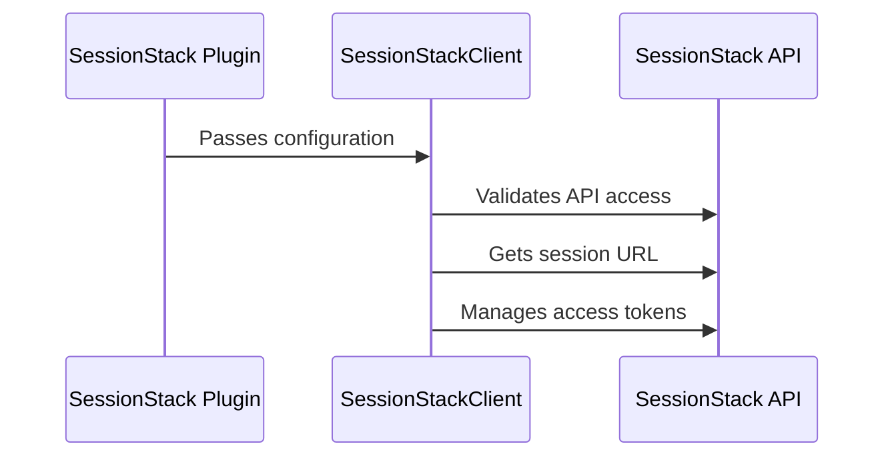

SessionStack is a plugin used in the Sentry application. It provides real-time session replay, allowing developers to see what users do on their website or web application. The plugin is defined in the `src/sentry_plugins/sessionstack/plugin.py` file. It requires certain configurations like `account_email`, `api_token`, and `website_id` to function properly. These configurations are fetched using the `get_config` function in the same file. The SessionStack plugin communicates with the SessionStack API, the URL for which is defined in `src/sentry_plugins/sessionstack/client.py` as `API_URL`. The plugin also uses the SessionStack player for session replay, the URL for which is defined as `PLAYER_URL` in the same file.

<SwmSnippet path="/src/sentry_plugins/sessionstack/plugin.py" line="91">

---

# SessionStack Plugin Configuration

The `get_config` method is used to retrieve the configuration for the SessionStack plugin. This includes the account email, API token, website ID, and optionally the API and player URLs. These are used to authenticate and interact with the SessionStack API.

```python
    def get_config(self, project, **kwargs):
        account_email = self.get_option("account_email", project)
        api_token = self.get_option("api_token", project)
        website_id = self.get_option("website_id", project)
        api_url = self.get_option("api_url", project)
        player_url = self.get_option("player_url", project)

        configurations = [
            {
                "name": "account_email",
                "label": "Account Email",
                "default": account_email,
                "type": "text",
                "placeholder": 'e.g. "user@example.com"',
                "required": True,
            },
            {
                "name": "api_token",
                "label": "API Token",
                "default": api_token,
                "type": "text",
```

---

</SwmSnippet>

<SwmSnippet path="/src/sentry_plugins/sessionstack/client.py" line="23">

---

# SessionStack API Interaction

The `SessionStackClient` class is used to interact with the SessionStack API. It uses the configuration provided to the plugin to make authenticated requests to the API. It defines methods to validate API access, get the URL for a session replay, and manage access tokens for sessions.

```python
    def __init__(self, account_email, api_token, website_id, **kwargs):
        self.website_id = website_id

        api_url = kwargs.get("api_url") or API_URL
        self.api_url = remove_trailing_slashes(api_url)

        player_url = kwargs.get("player_url") or PLAYER_URL
        self.player_url = remove_trailing_slashes(player_url)

        self.request_headers = {
            "Authorization": get_basic_auth(account_email, api_token),
            "Content-Type": "application/json",
        }

    def validate_api_access(self):
        website_endpoint = WEBSITES_ENDPOINT.format(self.website_id)

        try:
            response = self._make_request(website_endpoint, "GET")
        except requests.exceptions.ConnectionError:
            raise InvalidApiUrlError
```

---

</SwmSnippet>



&nbsp;

*This is an auto-generated document by Swimm AI 🌊 and has not yet been verified by a human*

<SwmMeta version="3.0.0" repo-id="Z2l0aHViJTNBJTNBZGVtby1zZW50cnklM0ElM0Fzd2ltbWlv" repo-name="demo-sentry"><sup>Powered by [Swimm](/)</sup></SwmMeta>
