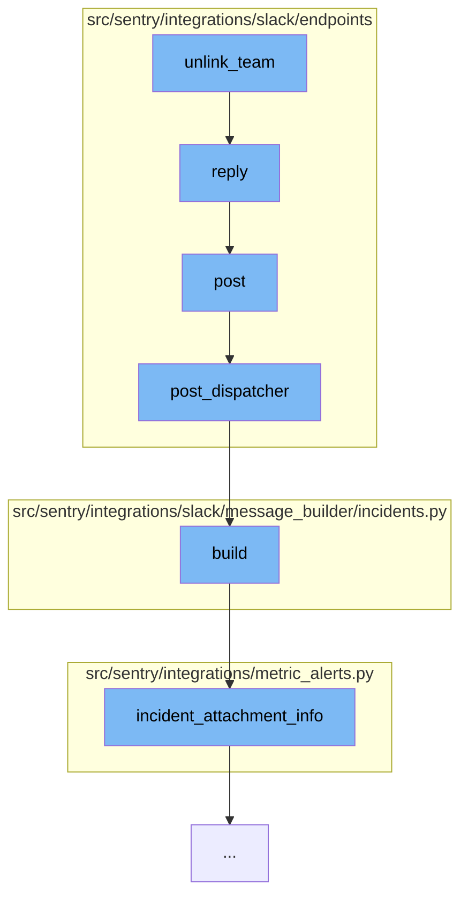

This document will cover the process of unlinking a team from the Slack integration in the Sentry application. The process includes the following steps:

1. Receiving and validating the Slack request.
2. Dispatching the request to the appropriate handler.
3. Building the response message.
4. Sending the response back to Slack.



<SwmSnippet path="/src/sentry/integrations/slack/endpoints/event.py" line="195">

---

# Receiving and validating the Slack request

The `post` function receives the Slack request and validates it. If the request is valid, it is further processed. If not, an error response is returned.

```python
    def post(self, request: Request) -> Response:
        try:
            slack_request = SlackEventRequest(request)
            slack_request.validate()
        except SlackRequestError as e:
            return self.respond(status=e.status)

        if slack_request.is_challenge():
            return self.on_url_verification(request, slack_request.data)
        if slack_request.type == "link_shared":
            if self.on_link_shared(request, slack_request):
                return self.respond()

        if slack_request.type == "message":
            if slack_request.is_bot():
                return self.respond()

            command, _ = slack_request.get_command_and_args()
            if command in COMMANDS:
                resp = super().post_dispatcher(slack_request)

```

---

</SwmSnippet>

<SwmSnippet path="/src/sentry/integrations/slack/endpoints/base.py" line="24">

---

# Dispatching the request to the appropriate handler

The `post_dispatcher` function takes the validated request and dispatches it to the appropriate handler based on the command received in the request.

```python
    def post_dispatcher(self, request: SlackDMRequest) -> Response:
        """
        All Slack commands are handled by this endpoint. This block just
        validates the request and dispatches it to the right handler.
        """
        command, args = request.get_command_and_args()

        if command in ["help", ""]:
            return self.respond(SlackHelpMessageBuilder().build())

        if command == "link":
            if not args:
                return self.link_user(request)

            if args[0] == "team":
                return self.link_team(request)

        if command == "unlink":
            if not args:
                return self.unlink_user(request)

```

---

</SwmSnippet>

<SwmSnippet path="/src/sentry/integrations/slack/message_builder/incidents.py" line="37">

---

# Building the response message

The `build` function constructs the response message that will be sent back to Slack. It uses the `incident_attachment_info` function to gather the necessary information about the incident.

```python
    def build(self, unfurl: bool = False) -> SlackBody:
        data = incident_attachment_info(
            self.incident, self.new_status, self.metric_value, unfurl=unfurl
        )

        return self._build(
            actions=[],
            color=INCIDENT_COLOR_MAPPING.get(data["status"]),
            fallback=data["title"],
            fields=[],
            footer=get_footer(data["ts"]),
            text=data["text"],
            title=data["title"],
            title_link=data["title_link"],
        )
```

---

</SwmSnippet>

<SwmSnippet path="/src/sentry/integrations/slack/endpoints/event.py" line="36">

---

# Sending the response back to Slack

The `reply` function sends the constructed message back to Slack. It uses the Slack API's `chat.postMessage` endpoint to send the message.

```python
    def reply(self, slack_request: SlackDMRequest, message: str) -> Response:
        headers = {"Authorization": f"Bearer {self._get_access_token(slack_request.integration)}"}
        payload = {"channel": slack_request.channel_name, "text": message}
        client = SlackClient()
        try:
            client.post("/chat.postMessage", headers=headers, data=payload, json=True)
        except ApiError as e:
            logger.error("slack.event.on-message-error", extra={"error": str(e)})

        return self.respond()
```

---

</SwmSnippet>

&nbsp;

*This is an auto-generated document by Swimm AI 🌊 and has not yet been verified by a human*

<SwmMeta version="3.0.0" repo-id="Z2l0aHViJTNBJTNBZGVtby1zZW50cnklM0ElM0Fzd2ltbWlv" repo-name="demo-sentry"><sup>Powered by [Swimm](/)</sup></SwmMeta>
