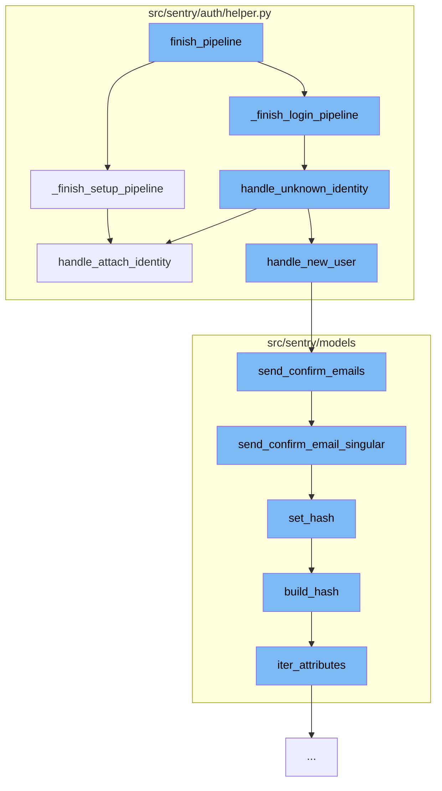

This document will cover the process of user authentication and email confirmation in the Sentry application. The process includes:

1. Finishing the authentication pipeline
2. Handling unknown identities
3. Attaching identities
4. Handling new users
5. Sending confirmation emails.



<SwmSnippet path="/src/sentry/auth/helper.py" line="765">

---

# Finishing the Authentication Pipeline

The `finish_pipeline` function is the entry point of the authentication process. It calls two helper functions `_finish_setup_pipeline` and `_finish_login_pipeline` based on the state of the user. These functions handle the setup and login process respectively.

```python
    def _finish_setup_pipeline(self, identity: Mapping[str, Any]):
        """
        The setup flow creates the auth provider as well as an identity linked
        to the active user.
        """
        request = self.request
        if not request.user.is_authenticated:
            return self.error(ERR_NOT_AUTHED)

        if request.user.id != self.state.uid:
            return self.error(ERR_UID_MISMATCH)

        data = self.fetch_state()
        config = self.provider.build_config(data)

        try:
            om = OrganizationMember.objects.get(user=request.user, organization=self.organization)
        except OrganizationMember.DoesNotExist:
            return self.error(ERR_UID_MISMATCH)

        # disable require 2FA for the organization
```

---

</SwmSnippet>

<SwmSnippet path="/src/sentry/auth/helper.py" line="414">

---

# Handling Unknown Identities

The `_finish_login_pipeline` function calls `handle_unknown_identity` function when an AuthIdentity is not present. This function handles the scenario when a user logs in but their identity is not known. It can either attach the identity to an existing user, merge it with an existing user, or create a new user based on this identity.

```python
    def handle_unknown_identity(
        self,
        state: AuthHelperSessionStore,
    ) -> HttpResponseRedirect:
        """
        Flow is activated upon a user logging in to where an AuthIdentity is
        not present.

        XXX(dcramer): this docstring is out of date

        The flow will attempt to answer the following:

        - Is there an existing user with the same email address? Should they be
          merged?

        - Is there an existing user (via authentication) that should be merged?

        - Should I create a new user based on this identity?
        """
        op = self.request.POST.get("op")
        login_form = (
```

---

</SwmSnippet>

<SwmSnippet path="/src/sentry/auth/helper.py" line="258">

---

# Attaching Identities

The `handle_attach_identity` function is called by both `handle_unknown_identity` and `_finish_setup_pipeline` functions. It attaches or re-attaches an identity to an already authenticated user.

```python
    def handle_attach_identity(self, member: Optional[OrganizationMember] = None) -> AuthIdentity:
        """
        Given an already authenticated user, attach or re-attach an identity.
        """
        # prioritize identifying by the SSO provider's user ID
        auth_identity = self._get_auth_identity(ident=self.identity["id"])
        if auth_identity is None:
            # otherwise look for an already attached identity
            # this can happen if the SSO provider's internal ID changes
            auth_identity = self._get_auth_identity(user=self.user)

        if auth_identity is None:
            auth_is_new = True
            auth_identity = AuthIdentity.objects.create(
                auth_provider=self.auth_provider,
                user=self.user,
                ident=self.identity["id"],
                data=self.identity.get("data", {}),
            )
        else:
            auth_is_new = False
```

---

</SwmSnippet>

<SwmSnippet path="/src/sentry/auth/helper.py" line="414">

---

# Handling New Users

The `handle_unknown_identity` function calls `handle_new_user` function when a new user needs to be created based on the identity. This function then calls `send_confirm_emails` function to send confirmation emails to the new user.

```python
    def handle_unknown_identity(
        self,
        state: AuthHelperSessionStore,
    ) -> HttpResponseRedirect:
        """
        Flow is activated upon a user logging in to where an AuthIdentity is
        not present.

        XXX(dcramer): this docstring is out of date

        The flow will attempt to answer the following:

        - Is there an existing user with the same email address? Should they be
          merged?

        - Is there an existing user (via authentication) that should be merged?

        - Should I create a new user based on this identity?
        """
        op = self.request.POST.get("op")
        login_form = (
```

---

</SwmSnippet>

<SwmSnippet path="/src/sentry/models/user.py" line="287">

---

# Sending Confirmation Emails

The `send_confirm_emails` function sends confirmation emails to the new user. It iterates over the list of unverified emails and sends a confirmation email to each one.

```python
    def send_confirm_emails(self, is_new_user=False):
        email_list = self.get_unverified_emails()
```

---

</SwmSnippet>

&nbsp;

*This is an auto-generated document by Swimm AI 🌊 and has not yet been verified by a human*

<SwmMeta version="3.0.0" repo-id="Z2l0aHViJTNBJTNBZGVtby1zZW50cnklM0ElM0Fzd2ltbWlv" repo-name="demo-sentry"><sup>Powered by [Swimm](/)</sup></SwmMeta>
