This document will cover the process of validating and querying organization events in the Sentry application. The process includes:

 1. Validating the request for organization events.
 2. Fetching the organization events.
 3. Querying the metrics for enhanced performance.
 4. Fetching the Snuba parameters for the organization events.
 5. Paginating the results.
 6. Querying suspect span groups.
 7. Resolving the function for organization events trends.
 8. Building the result handler for organization events trends.
 9. Resolving boolean conditions for the search events.
10. Resolving the column name for the search events.
11. Resolving the column for the search events.
12. Resolving the boolean condition for the search events.
13. Resolving the having condition for the search events.
14. Converting the aggregate filter to condition for the search events.
15. Getting the event stats data for the organization events.
16. Querying the Snuba for the discover events.
17. Getting the result for the API paginator.
18. Running the query for the search events.
19. Transforming the results for the Snuba discover.
20. Querying the Snuba with raw Snql query.

```mermaid
graph TD;
subgraph src/sentry/api/endpoints
  validate:::mainFlowStyle --> get
end
subgraph src/sentry/snuba
  get:::mainFlowStyle --> query
end
subgraph src/sentry/api/endpoints
  get:::mainFlowStyle --> get_snuba_params
end
subgraph src/sentry
  query --> run_query
end
subgraph src/sentry/snuba
  query --> transform_results
end
subgraph src/sentry/utils
  run_query --> raw_snql_query
end
subgraph src/sentry/snuba
  transform_results --> transform_meta
end
subgraph src/sentry/snuba
  transform_results --> transform_data
end
subgraph src/sentry/api/endpoints
  get_snuba_params:::mainFlowStyle --> get
end
subgraph src/sentry/api
  get:::mainFlowStyle --> paginate
end
subgraph src/sentry/api/endpoints
  get:::mainFlowStyle --> query_suspect_span_groups
end
subgraph src/sentry/api
  paginate --> get_result
end
subgraph src/sentry/utils
  get_result --> build_cursor
end
subgraph src/sentry/api
  get_result --> build_queryset
end
subgraph src/sentry
  get_result --> list
end
subgraph src/sentry/utils
  query_suspect_span_groups:::mainFlowStyle --> raw_snql_query
end
subgraph src/sentry/api/endpoints
  query_suspect_span_groups:::mainFlowStyle --> resolve_function
end
subgraph src/sentry/utils
  raw_snql_query --> _apply_cache_and_build_results
end
subgraph src/sentry/utils
  raw_snql_query --> incr
end
subgraph src/sentry/utils
  _apply_cache_and_build_results --> incr
end
subgraph src/sentry/utils
  _apply_cache_and_build_results --> _bulk_snuba_query
end
subgraph src/sentry/api
  incr --> put
end
subgraph src/sentry/utils
  incr --> _start
end
subgraph src/sentry/api/endpoints
  resolve_function:::mainFlowStyle --> get
end
subgraph src/sentry/api/endpoints
  get:::mainFlowStyle --> build_result_handler
end
subgraph src/sentry/utils
  get:::mainFlowStyle --> raw_snql_query
end
subgraph src/sentry/api
  get:::mainFlowStyle --> paginate
end
subgraph src/sentry
  get:::mainFlowStyle --> resolve_orderby
end
subgraph src/sentry
  get:::mainFlowStyle --> resolve_conditions
end
subgraph src/sentry/api
  build_result_handler --> get_event_stats_data
end
subgraph src/sentry/snuba
  build_result_handler --> top_events_timeseries
end
subgraph src/sentry/api/endpoints
  get_event_stats_data --> get_event_stats
end
subgraph src/sentry/snuba
  top_events_timeseries --> query
end
subgraph src/sentry/snuba
  top_events_timeseries --> get_timeseries_snuba_filter
end
subgraph src/sentry
  top_events_timeseries --> run_query
end
subgraph src/sentry/utils
  top_events_timeseries --> bulk_snql_query
end
subgraph src/sentry
  resolve_orderby --> resolve_column
end
subgraph src/sentry
  resolve_column --> resolve_function
end
subgraph src/sentry
  resolve_conditions:::mainFlowStyle --> resolve_boolean_conditions
end
subgraph src/sentry
  resolve_conditions:::mainFlowStyle --> resolve_having
end
subgraph src/sentry
  resolve_conditions:::mainFlowStyle --> parse_query
end
subgraph src/sentry
  resolve_boolean_conditions --> resolve_boolean_condition
end
subgraph src/sentry
  resolve_boolean_condition --> resolve_boolean_conditions
end
subgraph src/sentry
  resolve_boolean_condition --> resolve_having
end
subgraph src/sentry
  resolve_having --> convert_aggregate_filter_to_condition
end
subgraph src/sentry
  convert_aggregate_filter_to_condition --> resolve_function
end
subgraph src/sentry
  parse_query:::mainFlowStyle --> column
end
subgraph src/sentry/api
  parse_query:::mainFlowStyle --> parse_search_query
end
subgraph src/sentry
  column --> resolve_column_name
end
subgraph src/sentry
  resolve_column_name --> resolve_column
end
  parse_search_query:::mainFlowStyle --> ...

 classDef mainFlowStyle color:#000000,fill:#7CB9F4
  classDef rootsStyle color:#000000,fill:#00FFF4
```



<SwmSnippet path="/src/sentry/api/endpoints/organization_events_has_measurements.py" line="49">

---

# Validating the request for organization events

The `get` function in `organization_events_has_measurements.py` validates the request for organization events. If the request does not have the required feature, a 404 response is returned. Otherwise, it parses the parameters, checks for the existence of an event with measurements, and caches the results.

```python
    def get(self, request: Request, organization) -> Response:
        if not self.has_feature(organization, request):
            return Response(status=404)

        with sentry_sdk.start_span(op="discover.endpoint", description="parse params"):
            try:
                # This endpoint only allows for a single project + transaction, so no need
                # to check `global-views`.
                params = self.get_snuba_params(request, organization, check_global_views=False)

                # Once an transaction begins containing measurement data, it is unlikely
                # it will stop. So it makes more sense to always query the latest data.
                #
                # Additionally, to account for periods of low volume, increase the range
                # to 7 days to have a better chance of finding an example event and provide
                # a more consistent experience.
                now = timezone.now()
                params["start"] = now - timedelta(days=7)
                params["end"] = now
            except NoProjects:
                return Response({"measurements": False})
```

---

</SwmSnippet>

<SwmSnippet path="/src/sentry/api/endpoints/organization_events_spans_performance.py" line="151">

---

# Fetching the organization events

The `get` function in `organization_events_spans_performance.py` fetches the organization events. If the request does not have the required feature, a 404 response is returned. Otherwise, it gets the Snuba parameters, serializes the data, and queries the suspect span groups.

```python
    def get(self, request: Request, organization: Organization) -> Response:
        if not self.has_feature(request, organization):
            return Response(status=404)

        try:
            params = self.get_snuba_params(request, organization)
        except NoProjects:
            return Response(status=404)

        serializer = SpansPerformanceSerializer(data=request.GET)
        if not serializer.is_valid():
            return Response(serializer.errors, status=400)
        serialized = serializer.validated_data

        fields = serialized.get("field", [])
        query = serialized.get("query")
        span_ops = serialized.get("spanOp")
        span_groups = serialized.get("spanGroup")
        min_exclusive_time = serialized.get("min_exclusive_time")
        max_exclusive_time = serialized.get("max_exclusive_time")

```

---

</SwmSnippet>

<SwmSnippet path="/src/sentry/snuba/metrics_enhanced_performance.py" line="37">

---

# Querying the metrics for enhanced performance

The `query` function in `metrics_enhanced_performance.py` queries the metrics for enhanced performance. It checks if the metrics are compatible and if so, it runs the metrics query. If the metrics are not compatible, it runs the discover query.

```python
def query(
    selected_columns,
    query,
    params,
    equations=None,
    orderby=None,
    offset=None,
    limit=50,
    referrer=None,
    auto_fields=False,
    auto_aggregations=False,
    use_aggregate_conditions=False,
    allow_metric_aggregates=True,
    conditions=None,
    extra_snql_condition=None,
    functions_acl=None,
    use_snql=True,
    dry_run=False,
):
    metrics_compatible = not equations or dry_run

```

---

</SwmSnippet>

<SwmSnippet path="/src/sentry/api/endpoints/organization_events_spans_performance.py" line="151">

---

# Fetching the Snuba parameters for the organization events

The `get` function in `organization_events_spans_performance.py` fetches the Snuba parameters for the organization events. It gets the Snuba parameters and queries the suspect span groups.

```python
    def get(self, request: Request, organization: Organization) -> Response:
        if not self.has_feature(request, organization):
            return Response(status=404)

        try:
            params = self.get_snuba_params(request, organization)
        except NoProjects:
            return Response(status=404)

        serializer = SpansPerformanceSerializer(data=request.GET)
        if not serializer.is_valid():
            return Response(serializer.errors, status=400)
        serialized = serializer.validated_data

        fields = serialized.get("field", [])
        query = serialized.get("query")
        span_ops = serialized.get("spanOp")
        span_groups = serialized.get("spanGroup")
        min_exclusive_time = serialized.get("min_exclusive_time")
        max_exclusive_time = serialized.get("max_exclusive_time")

```

---

</SwmSnippet>

<SwmSnippet path="/src/sentry/api/base.py" line="320">

---

# Paginating the results

The `paginate` function in `base.py` paginates the results. It gets the per page limit, input cursor, and queryset. It then gets the result and maps the results based on a callback.

```python
    def paginate(
        self,
        request,
        on_results=None,
        paginator=None,
        paginator_cls=Paginator,
        default_per_page=100,
        max_per_page=100,
        cursor_cls=Cursor,
        **paginator_kwargs,
    ):
        assert (paginator and not paginator_kwargs) or (paginator_cls and paginator_kwargs)

        per_page = self.get_per_page(request, default_per_page, max_per_page)

        input_cursor = self.get_cursor_from_request(request, cursor_cls=cursor_cls)

        if not paginator:
            paginator = paginator_cls(**paginator_kwargs)

        try:
```

---

</SwmSnippet>

<SwmSnippet path="/src/sentry/api/endpoints/organization_events_spans_performance.py" line="151">

---

# Querying suspect span groups

The `get` function in `organization_events_spans_performance.py` queries the suspect span groups. It gets the Snuba parameters and queries the suspect span groups.

```python
    def get(self, request: Request, organization: Organization) -> Response:
        if not self.has_feature(request, organization):
            return Response(status=404)

        try:
            params = self.get_snuba_params(request, organization)
        except NoProjects:
            return Response(status=404)

        serializer = SpansPerformanceSerializer(data=request.GET)
        if not serializer.is_valid():
            return Response(serializer.errors, status=400)
        serialized = serializer.validated_data

        fields = serialized.get("field", [])
        query = serialized.get("query")
        span_ops = serialized.get("spanOp")
        span_groups = serialized.get("spanGroup")
        min_exclusive_time = serialized.get("min_exclusive_time")
        max_exclusive_time = serialized.get("max_exclusive_time")

```

---

</SwmSnippet>

<SwmSnippet path="/src/sentry/api/endpoints/organization_events_trends.py" line="418">

---

# Resolving the function for organization events trends

The `get` function in `organization_events_trends.py` resolves the function for organization events trends. It gets the Snuba parameters, trend type, trend function, selected columns, orderby, and query. It then builds the trend query and runs the query.

```python
    def get(self, request: Request, organization) -> Response:
        if not self.has_feature(organization, request):
            return Response(status=404)

        try:
            params = self.get_snuba_params(request, organization)
        except NoProjects:
            return Response([])

        with sentry_sdk.start_span(op="discover.endpoint", description="trend_dates"):
            middle_date = request.GET.get("middle")
            if middle_date:
                try:
                    middle = parse_datetime_string(middle_date)
                except InvalidQuery:
                    raise ParseError(detail=f"{middle_date} is not a valid date format")
                if middle <= params["start"] or middle >= params["end"]:
                    raise ParseError(
                        detail="The middle date should be within the duration of the query"
                    )
            else:
```

---

</SwmSnippet>

<SwmSnippet path="/src/sentry/api/endpoints/organization_events_trends.py" line="514">

---

# Building the result handler for organization events trends

The `build_result_handler` function in `organization_events_trends.py` builds the result handler for organization events trends. It gets the event stats data and returns the events and stats.

```python
    def build_result_handler(
        self,
        request,
        organization,
        params,
        trend_function,
        selected_columns,
        orderby,
        query,
    ):
        def on_results(events_results):
            def get_event_stats(query_columns, query, params, rollup, zerofill_results, _=None):
                return discover.top_events_timeseries(
                    query_columns,
                    selected_columns,
                    query,
                    params,
                    orderby,
                    rollup,
                    min(5, len(events_results["data"])),
                    organization,
```

---

</SwmSnippet>

<SwmSnippet path="/src/sentry/search/events/builder.py" line="276">

---

# Resolving boolean conditions for the search events

The `resolve_boolean_conditions` function in `builder.py` resolves the boolean conditions for the search events. It checks if the term is a ParenExpression and if so, it resolves the boolean conditions. If the term is a SearchFilter, it resolves the where condition. If the term is an AggregateFilter, it resolves the having condition.

```python
    def resolve_boolean_conditions(
        self, terms: ParsedTerms, use_aggregate_conditions: bool
    ) -> Tuple[List[WhereType], List[WhereType]]:
        if len(terms) == 1:
            return self.resolve_boolean_condition(terms[0], use_aggregate_conditions)

        # Filter out any ANDs since we can assume anything without an OR is an AND. Also do some
        # basic sanitization of the query: can't have two operators next to each other, and can't
        # start or end a query with an operator.
        prev: Union[ParsedTerm, None] = None
        new_terms = []
        term = None
        for term in terms:
            if prev:
                if SearchBoolean.is_operator(prev) and SearchBoolean.is_operator(term):
                    raise InvalidSearchQuery(
                        f"Missing condition in between two condition operators: '{prev} {term}'"
                    )
            else:
                if SearchBoolean.is_operator(term):
                    raise InvalidSearchQuery(
```

---

</SwmSnippet>

<SwmSnippet path="/src/sentry/search/events/builder.py" line="149">

---

# Resolving the column name for the search events

The `resolve_column_name` function in `builder.py` resolves the column name for the search events. It gets the column resolver and returns the resolved column.

```python
    def resolve_column_name(self, col: str) -> str:
        # TODO when utils/snuba.py becomes typed don't need this extra annotation
        column_resolver: Callable[[str], str] = resolve_column(self.dataset)
        return column_resolver(col)
```

---

</SwmSnippet>

<SwmSnippet path="/src/sentry/search/events/builder.py" line="692">

---

# Resolving the column for the search events

The `resolve_column` function in `builder.py` resolves the column for the search events. It checks if the field is a function and if so, it resolves the function. If the field is a field alias, it resolves the field alias. Otherwise, it resolves the field.

```python
    def resolve_column(self, field: str, alias: bool = False) -> SelectType:
        """Given a public field, construct the corresponding Snql, this
        function will determine the type of the field alias, whether its a
        column, field alias or function and call the corresponding resolver

        :param field: The public field string to resolve into Snql. This may
                      be a column, field alias, or even a function.
        :param alias: Whether or not the resolved column is aliased to the
                      original name. If false, it may still have an alias
                      but is not guaranteed.
        """
        match = is_function(field)
        if match:
            return self.resolve_function(field, match)
        elif self.is_field_alias(field):
            return self.resolve_field_alias(field)
        else:
            return self.resolve_field(field, alias=alias)
```

---

</SwmSnippet>

<SwmSnippet path="/src/sentry/search/events/builder.py" line="338">

---

# Resolving the boolean condition for the search events

The `resolve_boolean_condition` function in `builder.py` resolves the boolean condition for the search events. It checks if the term is a ParenExpression and if so, it resolves the boolean conditions. If the term is a SearchFilter, it resolves the where condition. If the term is an AggregateFilter, it resolves the having condition.

```python
    def resolve_boolean_condition(
        self, term: ParsedTerm, use_aggregate_conditions: bool
    ) -> Tuple[List[WhereType], List[WhereType]]:
        if isinstance(term, ParenExpression):
            return self.resolve_boolean_conditions(term.children, use_aggregate_conditions)

        where, having = [], []

        if isinstance(term, SearchFilter):
            where = self.resolve_where([term])
        elif isinstance(term, AggregateFilter):
            having = self.resolve_having([term], use_aggregate_conditions)

```

---

</SwmSnippet>

<SwmSnippet path="/src/sentry/search/events/builder.py" line="232">

---

# Resolving the having condition for the search events

The `resolve_having` function in `builder.py` resolves the having condition for the search events. It checks if the use of aggregate conditions is allowed and if so, it resolves the having conditions.

```python
    def resolve_having(
        self, parsed_terms: ParsedTerms, use_aggregate_conditions: bool
    ) -> List[WhereType]:
        """Given a list of parsed terms, construct their equivalent snql having
        conditions, filtering only for aggregate conditions"""

        if not use_aggregate_conditions:
            return []

        having_conditions: List[WhereType] = []
        for term in parsed_terms:
            if isinstance(term, AggregateFilter):
                condition = self.convert_aggregate_filter_to_condition(term)
                if condition:
                    having_conditions.append(condition)

        return having_conditions
```

---

</SwmSnippet>

<SwmSnippet path="/src/sentry/search/events/builder.py" line="898">

---

# Converting the aggregate filter to condition for the search events

The `convert_aggregate_filter_to_condition` function in `builder.py` converts the aggregate filter to condition for the search events. It gets the name and value from the aggregate filter and converts the value to timestamp if necessary. It then checks if the operator is '=' or '!=' and if the value is empty. If so, it returns a condition with the operator as IS_NULL or IS_NOT_NULL. Otherwise, it resolves the function and returns a condition with the operator and value.

```python
    def convert_aggregate_filter_to_condition(
        self, aggregate_filter: AggregateFilter
    ) -> Optional[WhereType]:
        name = aggregate_filter.key.name
        value = aggregate_filter.value.value

        value = (
            int(to_timestamp(value))
            if isinstance(value, datetime) and name != "timestamp"
            else value
        )

        if aggregate_filter.operator in {"=", "!="} and value == "":
            operator = Op.IS_NULL if aggregate_filter.operator == "=" else Op.IS_NOT_NULL
            return Condition(name, operator)

```

---

</SwmSnippet>

<SwmSnippet path="/src/sentry/api/bases/organization_events.py" line="299">

---

# Getting the event stats data for the organization events

The `get_event_stats_data` function in `organization_events.py` gets the event stats data for the organization events. It checks if the request has the required feature and if so, it gets the rollup from the request, query columns, and runs the get_event_stats function. It then serializes the result.

```python
    def get_event_stats_data(
        self,
        request: Request,
        organization: Organization,
        get_event_stats: Callable[
            [Sequence[str], str, Dict[str, str], int, bool, Optional[timedelta]], SnubaTSResult
        ],
        top_events: int = 0,
        query_column: str = "count()",
        params: Optional[Dict[str, Any]] = None,
        query: Optional[str] = None,
        allow_partial_buckets: bool = False,
        zerofill_results: bool = True,
        comparison_delta: Optional[timedelta] = None,
    ) -> Dict[str, Any]:
        with self.handle_query_errors():
            with sentry_sdk.start_span(
                op="discover.endpoint", description="base.stats_query_creation"
            ):
                columns = request.GET.getlist("yAxis", [query_column])
                if query is None:
```

---

</SwmSnippet>

<SwmSnippet path="/src/sentry/snuba/discover.py" line="201">

---

# Querying the Snuba for the discover events

The `query` function in `discover.py` queries the Snuba for the discover events. It prepares the discover query and runs the raw query. It then transforms the results.

```python
def query(
    selected_columns,
    query,
    params,
    equations=None,
    orderby=None,
    offset=None,
    limit=50,
    referrer=None,
    auto_fields=False,
    auto_aggregations=False,
    include_equation_fields=False,
    allow_metric_aggregates=False,
    use_aggregate_conditions=False,
    conditions=None,
    extra_snql_condition=None,
    functions_acl=None,
    use_snql=True,
):
    """
    High-level API for doing arbitrary user queries against events.
```

---

</SwmSnippet>

&nbsp;

*This is an auto-generated document by Swimm AI 🌊 and has not yet been verified by a human*

<SwmMeta version="3.0.0" repo-id="Z2l0aHViJTNBJTNBZGVtby1zZW50cnklM0ElM0Fzd2ltbWlv" repo-name="demo-sentry"><sup>Powered by [Swimm](/)</sup></SwmMeta>
