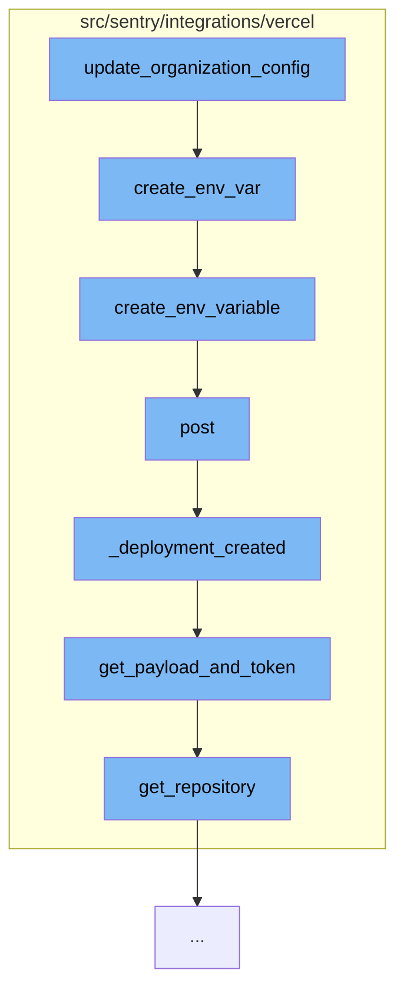

This document will cover the process of updating the organization configuration in the Vercel integration, which includes:

1. Creating an environment variable
2. Posting the variable to the Vercel API
3. Handling the deployment creation event
4. Getting the payload and token for the release
5. Determining the repository based on the provider.



<SwmSnippet path="/src/sentry/integrations/vercel/integration.py" line="255">

---

# Creating an environment variable

The function `create_env_var` is used to create an environment variable for a Vercel project. If the variable already exists, it attempts to update it instead.

```python
    def create_env_var(self, client, vercel_project_id, key, value, type):
        data = {
            "key": key,
            "value": value,
            "target": ["production"],
            "type": type,
        }
        try:
            return client.create_env_variable(vercel_project_id, data)
        except ApiError as e:
            if e.json and e.json.get("error", {}).get("code") == "ENV_ALREADY_EXISTS":
                try:
                    return self.update_env_variable(client, vercel_project_id, data)
                except ApiError as e:
                    error_message = (
                        e.json.get("error", {}).get("message")
                        if e.json
                        else f"Could not update environment variable {key}."
                    )
                    raise ValidationError({"project_mappings": [error_message]})
            raise
```

---

</SwmSnippet>

<SwmSnippet path="/src/sentry/integrations/vercel/client.py" line="76">

---

# Posting the variable to the Vercel API

The function `create_env_variable` posts the environment variable to the Vercel API.

```python
    def create_env_variable(self, vercel_project_id, data):
        return self.post(self.ENV_VAR_URL % vercel_project_id, data=data)
```

---

</SwmSnippet>

<SwmSnippet path="/src/sentry/integrations/vercel/generic_webhook.py" line="273">

---

# Handling the deployment creation event

The function `_deployment_created` handles the deployment creation event. It finds the organization and project that match the Vercel project, gets the payload and token for the release, and creates the release.

```python
    def _deployment_created(self, external_id, request):
        payload = request.data["payload"]
        # Only create releases for production deploys for now
        if payload["target"] != "production":
            logger.info(
                f"Ignoring deployment for environment: {payload['target']}",
                extra={"external_id": external_id, "vercel_project_id": payload["projectId"]},
            )
            return self.respond(status=204)
        """
        Steps:
            1. Find all org integrations that match the external id
            2. Search the configs to find one that matches the vercel project of the webhook
            3. Look up the Sentry project that matches
            4. Look up the connected internal integration
            5. Find the token associated with that installation
            6. Determine the commit sha and repo based on what provider is used
            7. Create the release using the token WITHOUT refs
            8. Update the release with refs
        """
        vercel_project_id = payload["projectId"]
```

---

</SwmSnippet>

<SwmSnippet path="/src/sentry/integrations/vercel/generic_webhook.py" line="94">

---

# Getting the payload and token for the release

The function `get_payload_and_token` gets the payload and token for the release. It looks up the project and the connected Sentry app installation, and finds a token associated with the installation.

```python
def get_payload_and_token(
    payload: Mapping[str, Any], organization_id: int, sentry_project_id: int
) -> Tuple[Mapping[str, Any], str]:
    meta = payload["deployment"]["meta"]

    # look up the project so we can get the slug
    project = Project.objects.get(id=sentry_project_id)

    # find the connected sentry app installation
    installation_for_provider = SentryAppInstallationForProvider.objects.select_related(
        "sentry_app_installation"
    ).get(organization_id=organization_id, provider="vercel")
    sentry_app_installation = installation_for_provider.sentry_app_installation

    # find a token associated with the installation so we can use it for authentication
    sentry_app_installation_token = (
        SentryAppInstallationToken.objects.select_related("api_token")
        .filter(sentry_app_installation=sentry_app_installation)
        .first()
    )
    if not sentry_app_installation_token:
```

---

</SwmSnippet>

<SwmSnippet path="/src/sentry/integrations/vercel/generic_webhook.py" line="73">

---

# Determining the repository based on the provider

The function `get_repository` determines the repository based on the provider. It supports GitHub, GitLab, and Bitbucket.

```python
def get_repository(meta: Mapping[str, str]) -> str:
    """Construct the repository string depending what provider we use."""

    try:
        if meta.get("githubCommitSha"):
            # We use these instead of githubOrg and githubRepo since it's the repo the user has access to.
            return f'{meta["githubCommitOrg"]}/{meta["githubCommitRepo"]}'

        if meta.get("gitlabCommitSha"):
            # GitLab repos are formatted with a space for some reason.
            return f'{meta["gitlabProjectNamespace"]} / {meta["gitlabProjectName"]}'

        if meta.get("bitbucketCommitSha"):
            return f'{meta["bitbucketRepoOwner"]}/{meta["bitbucketRepoName"]}'

    except KeyError:
        pass

    raise MissingRepositoryError("Could not determine repository")
```

---

</SwmSnippet>

&nbsp;

*This is an auto-generated document by Swimm AI 🌊 and has not yet been verified by a human*

<SwmMeta version="3.0.0" repo-id="Z2l0aHViJTNBJTNBZGVtby1zZW50cnklM0ElM0Fzd2ltbWlv" repo-name="demo-sentry"><sup>Powered by [Swimm](/)</sup></SwmMeta>
