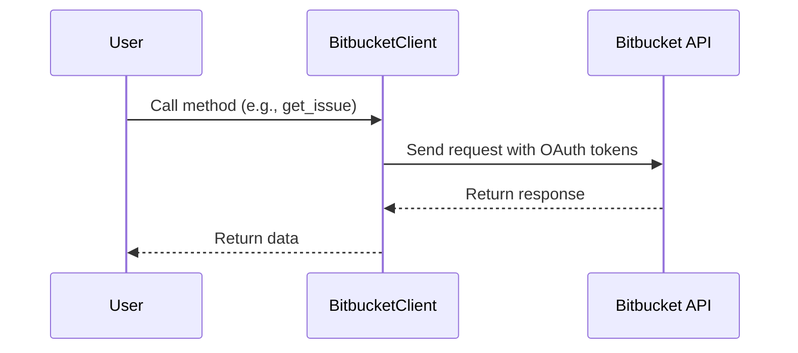

Bitbucket is a web-based version control repository hosting service owned by Atlassian, for source code and development projects that use either Mercurial or Git revision control systems. In the context of the demo-sentry repository, Bitbucket is integrated as a plugin. The Bitbucket plugin allows you to link a repository to a project, enabling the integration of Bitbucket issues. This is achieved by using the Bitbucket API, as seen in the `BitbucketClient` class in `src/sentry_plugins/bitbucket/client.py`. The plugin is configured with constants such as `slug`, `conf_title`, `conf_key`, and `auth_provider` in `src/sentry_plugins/bitbucket/plugin.py`. The `BitbucketWebhookEndpoint` class in `src/sentry_plugins/bitbucket/endpoints/webhook.py` handles incoming webhooks from Bitbucket.

<SwmSnippet path="/src/sentry_plugins/bitbucket/client.py" line="8">

---

# Bitbucket Endpoints in Sentry

The `BitbucketClient` class in this file defines several methods that interact with Bitbucket's API. Each method corresponds to a specific endpoint. For example, `get_issue` retrieves an issue from a repository, `create_issue` creates a new issue, `search_issues` searches for issues, and `create_comment` creates a new comment on an issue. The `get_repo` method retrieves a repository, and `create_hook` and `delete_hook` manage hooks for a repository. The `get_commit_filechanges` and `compare_commits` methods interact with commit-related endpoints, fetching file changes for a commit and comparing commits, respectively.

```python
class BitbucketClient(AuthApiClient):
    base_url = "https://api.bitbucket.org"
    plugin_name = "bitbucket"

    def has_auth(self):
        return (
            self.auth
            and "oauth_token" in self.auth.tokens
            and "oauth_token_secret" in self.auth.tokens
        )

    def bind_auth(self, **kwargs):
        kwargs["auth"] = OAuth1(
            str(settings.BITBUCKET_CONSUMER_KEY),
            str(settings.BITBUCKET_CONSUMER_SECRET),
            self.auth.tokens["oauth_token"],
            self.auth.tokens["oauth_token_secret"],
            signature_type="auth_header",
        )
        return kwargs

```

---

</SwmSnippet>

<SwmSnippet path="/src/sentry_plugins/bitbucket/client.py" line="12">

---

# Bitbucket OAuth Authentication

The `BitbucketClient` uses OAuth for authentication. The `has_auth` method checks if the client has OAuth tokens, and the `bind_auth` method binds the OAuth tokens to the request. The OAuth tokens are obtained from the `BITBUCKET_CONSUMER_KEY` and `BITBUCKET_CONSUMER_SECRET` settings, which are set in the `sentry.conf.py` file as mentioned in the `README.rst` file.

```python
    def has_auth(self):
        return (
            self.auth
            and "oauth_token" in self.auth.tokens
            and "oauth_token_secret" in self.auth.tokens
        )

    def bind_auth(self, **kwargs):
        kwargs["auth"] = OAuth1(
            str(settings.BITBUCKET_CONSUMER_KEY),
            str(settings.BITBUCKET_CONSUMER_SECRET),
            self.auth.tokens["oauth_token"],
            self.auth.tokens["oauth_token_secret"],
            signature_type="auth_header",
        )
        return kwargs
```

---

</SwmSnippet>



&nbsp;

*This is an auto-generated document by Swimm AI 🌊 and has not yet been verified by a human*

<SwmMeta version="3.0.0" repo-id="Z2l0aHViJTNBJTNBZGVtby1zZW50cnklM0ElM0Fzd2ltbWlv" repo-name="demo-sentry"><sup>Powered by [Swimm](/)</sup></SwmMeta>
