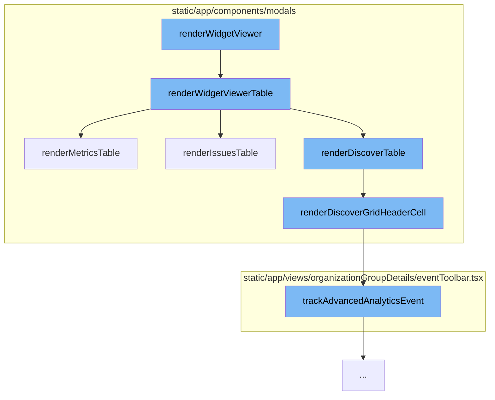

This document will cover the process of rendering widgets in the Sentry application. We'll cover:

1. The function `renderWidgetViewer` and its role in the process.
2. How `renderWidgetViewer` calls `renderWidgetViewerTable`.
3. The different tables that `renderWidgetViewerTable` can render.
4. How `renderDiscoverGridHeaderCell` is used in the rendering of the Discover table.
5. The role of `trackAdvancedAnalyticsEvent` in the process.



<SwmSnippet path="/static/app/components/modals/widgetViewerModal.tsx" line="600">

---

# The function `renderWidgetViewer`

The function `renderWidgetViewerTable` is responsible for rendering different types of widgets based on the `widgetType`. It can render an Issues table, a Metrics table, or a Discover table. The data for these tables is fetched and passed to the respective render functions.

```tsx
  function renderWidgetViewerTable() {
    switch (widget.widgetType) {
      case WidgetType.ISSUE:
        if (issuesData && chartUnmodified && widget.displayType === DisplayType.TABLE) {
          return renderIssuesTable({
            transformedResults: issuesData,
            loading: false,
            errorMessage: undefined,
            pageLinks: defaultPageLinks,
            totalCount: totalIssuesCount,
          });
        }
        return (
          <IssueWidgetQueries
            api={api}
            organization={organization}
            widget={tableWidget}
            selection={modalSelection}
            limit={
              widget.displayType === DisplayType.TABLE
                ? FULL_TABLE_ITEM_LIMIT
```

---

</SwmSnippet>

<SwmSnippet path="/static/app/components/modals/widgetViewerModal/widgetViewerTableCell.tsx" line="88">

---

# Rendering the Discover table

The function `renderDiscoverGridHeaderCell` is used to render the header cells of the Discover table. It generates a sort link for each column in the table. When a header cell is clicked, it triggers the `trackAdvancedAnalyticsEvent` function to track the event.

```tsx
export const renderDiscoverGridHeaderCell =
  ({location, selection, widget, tableData, organization, onHeaderClick}: Props) =>
  (column: TableColumn<keyof TableDataRow>, _columnIndex: number): React.ReactNode => {
    const eventView = eventViewFromWidget(
      widget.title,
      widget.queries[0],
      selection,
      widget.displayType
    );
    const tableMeta = tableData?.meta;
    const align = fieldAlignment(column.name, column.type, tableMeta);
    const field = {field: String(column.key), width: column.width};
    function generateSortLink(): LocationDescriptorObject | undefined {
      if (!tableMeta) {
        return undefined;
      }

      const nextEventView = eventView.sortOnField(field, tableMeta);
      const queryStringObject = nextEventView.generateQueryStringObject();

      return {
```

---

</SwmSnippet>

&nbsp;

*This is an auto-generated document by Swimm AI 🌊 and has not yet been verified by a human*

<SwmMeta version="3.0.0" repo-id="Z2l0aHViJTNBJTNBZGVtby1zZW50cnklM0ElM0Fzd2ltbWlv" repo-name="demo-sentry"><sup>Powered by [Swimm](/)</sup></SwmMeta>
