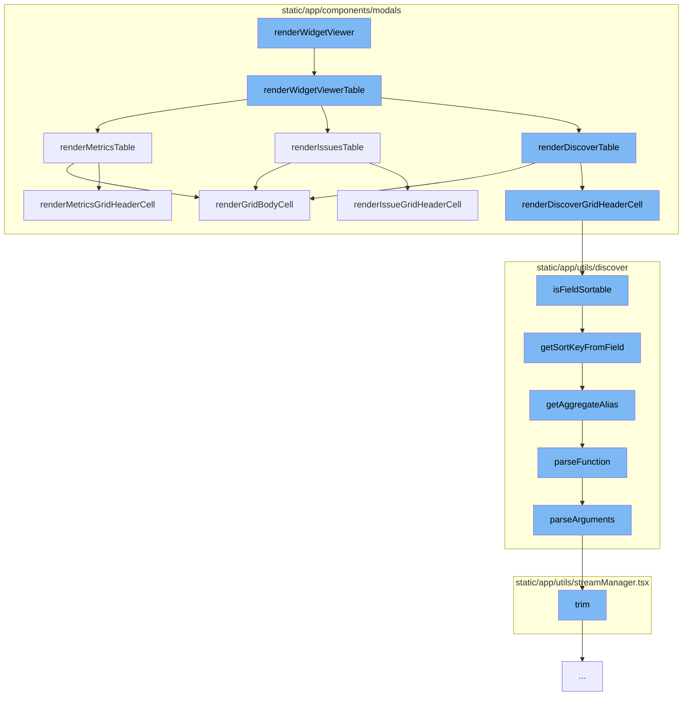

This document will cover the process of rendering widgets in the Sentry application. The process includes:

1. Rendering the Widget Viewer
2. Rendering the Widget Viewer Table
3. Rendering the Metrics Table
4. Rendering the Grid Body Cell
5. Parsing the function and arguments



<SwmSnippet path="/static/app/components/modals/widgetViewerModal.tsx" line="600">

---

# Rendering the Widget Viewer

The `renderWidgetViewerTable` function is responsible for rendering the widget viewer table. It checks the widget type and based on the type, it calls the appropriate function to render the table.

```tsx
  function renderWidgetViewerTable() {
    switch (widget.widgetType) {
      case WidgetType.ISSUE:
        if (issuesData && chartUnmodified && widget.displayType === DisplayType.TABLE) {
          return renderIssuesTable({
            transformedResults: issuesData,
            loading: false,
            errorMessage: undefined,
            pageLinks: defaultPageLinks,
            totalCount: totalIssuesCount,
          });
        }
        return (
          <IssueWidgetQueries
            api={api}
            organization={organization}
            widget={tableWidget}
            selection={modalSelection}
            limit={
              widget.displayType === DisplayType.TABLE
                ? FULL_TABLE_ITEM_LIMIT
```

---

</SwmSnippet>

<SwmSnippet path="/static/app/components/modals/widgetViewerModal.tsx" line="513">

---

# Rendering the Widget Viewer Table

The `renderMetricsTable` function is responsible for rendering the metrics table. It takes the table results, loading status, and page links as parameters and returns a React Fragment that includes the GridEditable component and Pagination component if there are previous or next results.

```tsx
  const renderMetricsTable: MetricsWidgetQueries['props']['children'] = ({
    tableResults,
    loading,
    pageLinks,
  }) => {
    const links = parseLinkHeader(pageLinks ?? null);
    const isFirstPage = links.previous?.results === false;
    return (
      <React.Fragment>
        <GridEditable
          isLoading={loading}
          data={tableResults?.[0]?.data ?? []}
          columnOrder={columnOrder}
          columnSortBy={columnSortBy}
          grid={{
            renderHeadCell: renderMetricsGridHeaderCell({
              ...props,
              widget: tableWidget,
              tableData: tableResults?.[0],
              onHeaderClick: () => {
                if ([DisplayType.TOP_N, DisplayType.TABLE].includes(widget.displayType)) {
```

---

</SwmSnippet>

<SwmSnippet path="/static/app/components/modals/widgetViewerModal/widgetViewerTableCell.tsx" line="146">

---

# Rendering the Metrics Table

The `renderGridBodyCell` function is responsible for rendering the grid body cell. It checks the widget type and based on the type, it calls the appropriate function to render the cell.

```tsx
export const renderGridBodyCell =
  ({location, organization, widget, tableData, isFirstPage}: Props) =>
  (
    column: GridColumnOrder,
    dataRow: Record<string, any>,
    rowIndex: number,
    columnIndex: number
  ): React.ReactNode => {
    const columnKey = String(column.key);
    const isTopEvents = widget.displayType === DisplayType.TOP_N;
    let cell: React.ReactNode;
    switch (widget.widgetType) {
      case WidgetType.ISSUE:
        cell = (
          getIssueFieldRenderer(columnKey) ?? getFieldRenderer(columnKey, ISSUE_FIELDS)
        )(dataRow, {organization, location});
        break;
      case WidgetType.DISCOVER:
      default:
        if (!tableData || !tableData.meta) {
          return dataRow[column.key];
```

---

</SwmSnippet>

<SwmSnippet path="/static/app/utils/discover/eventView.tsx" line="116">

---

# Rendering the Grid Body Cell

The `isFieldSortable` function checks if a field is sortable by calling the `getSortKeyFromField` function.

```tsx
export function isFieldSortable(field: Field, tableMeta?: MetaType): boolean {
  return !!getSortKeyFromField(field, tableMeta);
}
```

---

</SwmSnippet>

<SwmSnippet path="/static/app/utils/discover/fields.tsx" line="821">

---

# Parsing the function and arguments

The `parseFunction` function is responsible for parsing the function and its arguments. It matches the field with the AGGREGATE_PATTERN and if it matches, it returns the function name and its arguments.

```tsx
export function parseFunction(field: string): ParsedFunction | null {
  const results = field.match(AGGREGATE_PATTERN);
  if (results && results.length === 3) {
    return {
      name: results[1],
      arguments: parseArguments(results[1], results[2]),
    };
  }

  return null;
}
```

---

</SwmSnippet>

&nbsp;

*This is an auto-generated document by Swimm AI 🌊 and has not yet been verified by a human*

<SwmMeta version="3.0.0" repo-id="Z2l0aHViJTNBJTNBZGVtby1zZW50cnklM0ElM0Fzd2ltbWlv" repo-name="demo-sentry"><sup>Powered by [Swimm](/)</sup></SwmMeta>
