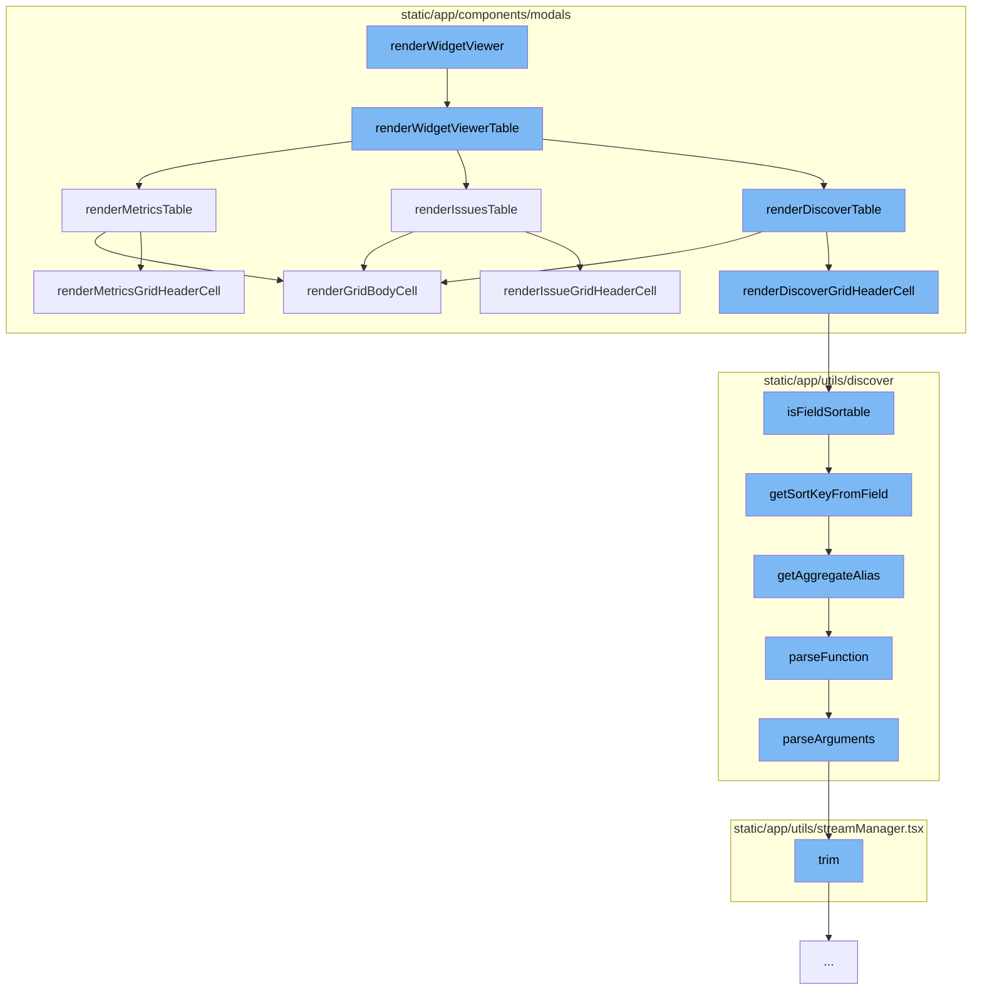

This document will cover the process of rendering the Widget Viewer in the Sentry application. The process includes:

1. Rendering the Widget Viewer Table
2. Rendering the specific table based on the widget type
3. Rendering the Grid Body Cell
4. Parsing the function and arguments for the field rendering.



<SwmSnippet path="/static/app/components/modals/widgetViewerModal.tsx" line="600">

---

# Rendering the Widget Viewer Table

The `renderWidgetViewerTable` function is the starting point of the flow. It checks the widget type and based on the type, it either directly renders the corresponding table (Issues, Metrics, or Discover) if the data is available and the chart is unmodified, or it queries for the data and then renders the table.

```tsx
  function renderWidgetViewerTable() {
    switch (widget.widgetType) {
      case WidgetType.ISSUE:
        if (issuesData && chartUnmodified && widget.displayType === DisplayType.TABLE) {
          return renderIssuesTable({
            transformedResults: issuesData,
            loading: false,
            errorMessage: undefined,
            pageLinks: defaultPageLinks,
            totalCount: totalIssuesCount,
          });
        }
        return (
          <IssueWidgetQueries
            api={api}
            organization={organization}
            widget={tableWidget}
            selection={modalSelection}
            limit={
              widget.displayType === DisplayType.TABLE
                ? FULL_TABLE_ITEM_LIMIT
```

---

</SwmSnippet>

<SwmSnippet path="/static/app/components/modals/widgetViewerModal.tsx" line="513">

---

# Rendering the specific table based on the widget type

The `renderMetricsTable` function is an example of how the specific table for a widget type is rendered. It takes the table results and loading status as parameters, and renders the `GridEditable` component with the appropriate props. It also handles pagination if there are previous or next results.

```tsx
  const renderMetricsTable: MetricsWidgetQueries['props']['children'] = ({
    tableResults,
    loading,
    pageLinks,
  }) => {
    const links = parseLinkHeader(pageLinks ?? null);
    const isFirstPage = links.previous?.results === false;
    return (
      <React.Fragment>
        <GridEditable
          isLoading={loading}
          data={tableResults?.[0]?.data ?? []}
          columnOrder={columnOrder}
          columnSortBy={columnSortBy}
          grid={{
            renderHeadCell: renderMetricsGridHeaderCell({
              ...props,
              widget: tableWidget,
              tableData: tableResults?.[0],
              onHeaderClick: () => {
                if ([DisplayType.TOP_N, DisplayType.TABLE].includes(widget.displayType)) {
```

---

</SwmSnippet>

<SwmSnippet path="/static/app/components/modals/widgetViewerModal/widgetViewerTableCell.tsx" line="146">

---

# Rendering the Grid Body Cell

The `renderGridBodyCell` function is responsible for rendering the individual cells in the grid. It checks the widget type and based on the type, it uses the appropriate field renderer to render the cell. If the value in the cell is an integer greater than 999, it wraps the cell in a tooltip to display the full value.

```tsx
export const renderGridBodyCell =
  ({location, organization, widget, tableData, isFirstPage}: Props) =>
  (
    column: GridColumnOrder,
    dataRow: Record<string, any>,
    rowIndex: number,
    columnIndex: number
  ): React.ReactNode => {
    const columnKey = String(column.key);
    const isTopEvents = widget.displayType === DisplayType.TOP_N;
    let cell: React.ReactNode;
    switch (widget.widgetType) {
      case WidgetType.ISSUE:
        cell = (
          getIssueFieldRenderer(columnKey) ?? getFieldRenderer(columnKey, ISSUE_FIELDS)
        )(dataRow, {organization, location});
        break;
      case WidgetType.DISCOVER:
      default:
        if (!tableData || !tableData.meta) {
          return dataRow[column.key];
```

---

</SwmSnippet>

<SwmSnippet path="/static/app/utils/discover/fields.tsx" line="821">

---

# Parsing the function and arguments for the field rendering

The `parseFunction` and `parseArguments` functions are used to parse the function and arguments for the field rendering. The `parseFunction` function matches the field against a pattern to extract the function name and arguments. The `parseArguments` function then parses the arguments based on the function name.

```tsx
export function parseFunction(field: string): ParsedFunction | null {
  const results = field.match(AGGREGATE_PATTERN);
  if (results && results.length === 3) {
    return {
      name: results[1],
      arguments: parseArguments(results[1], results[2]),
    };
  }

  return null;
}

export function parseArguments(functionText: string, columnText: string): string[] {
  // Some functions take a quoted string for their arguments that may contain commas
  // This function attempts to be identical with the similarly named parse_arguments
  // found in src/sentry/search/events/fields.py
  if (
    (functionText !== 'to_other' &&
      functionText !== 'count_if' &&
      functionText !== 'spans_histogram') ||
    columnText.length === 0
```

---

</SwmSnippet>

&nbsp;

*This is an auto-generated document by Swimm AI 🌊 and has not yet been verified by a human*

<SwmMeta version="3.0.0" repo-id="Z2l0aHViJTNBJTNBZGVtby1zZW50cnklM0ElM0Fzd2ltbWlv" repo-name="demo-sentry"><sup>Powered by [Swimm](/)</sup></SwmMeta>
