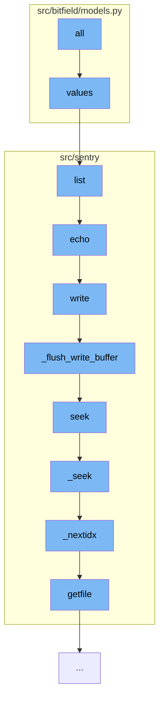

This document will cover the process of writing data to a file in the S3 filestore. The process includes the following steps:

1. Retrieving the values from the project options
2. Listing the permissions for a user
3. Echoing the output
4. Writing the content to the S3 filestore
5. Seeking to the correct position in the file



<SwmSnippet path="/src/bitfield/models.py" line="47">

---

# Retrieving the values from the project options

The `values` function is used to retrieve the values from the project options. It does this by iterating over the values and returning them as a list.

```python
    def values(self):
        return list(self.itervalues())  # NOQA
```

---

</SwmSnippet>

<SwmSnippet path="/src/sentry/runner/commands/permissions.py" line="68">

---

# Listing the permissions for a user

The `list` function is used to list the permissions for a user. It does this by querying the `UserPermission` objects for the specified user and ordering them by permission. The permissions are then echoed to the output.

```python
def list(user):
    "List permissions for a user."
    from sentry.models import UserPermission

    user = user_param_to_user(user)
    up_list = UserPermission.objects.filter(user=user).order_by("permission")
    click.echo(f"Permissions for `{user.username}`:")
    for permission in up_list:
        click.echo(f"- {permission.permission}")
```

---

</SwmSnippet>

<SwmSnippet path="/src/sentry/filestore/s3.py" line="180">

---

# Writing the content to the S3 filestore

The `write` function is used to write the content to the S3 filestore. It first checks if the file was opened in write mode, then initiates a multipart upload if necessary, and finally writes the content to the filestore.

```python
    def write(self, content):
        if "w" not in self._mode:
            raise AttributeError("File was not opened in write mode.")
        self._is_dirty = True
        if self._multipart is None:
            parameters = self._storage.object_parameters.copy()
            parameters["ACL"] = self._storage.default_acl
            parameters["ContentType"] = (
                mimetypes.guess_type(self.obj.key)[0] or self._storage.default_content_type
            )
            if self._storage.reduced_redundancy:
                parameters["StorageClass"] = "REDUCED_REDUNDANCY"
            if self._storage.encryption:
                parameters["ServerSideEncryption"] = "AES256"
            self._multipart = self.obj.initiate_multipart_upload(**parameters)
        if self.buffer_size <= self._buffer_file_size:
            self._flush_write_buffer()
        return super().write(force_bytes(content))
```

---

</SwmSnippet>

<SwmSnippet path="/src/sentry/models/file.py" line="597">

---

# Seeking to the correct position in the file

The `seek` function is used to seek to the correct position in the file. It does this by checking the `whence` parameter and calling the `_seek` function with the appropriate position.

```python
    def seek(self, pos, whence=io.SEEK_SET):
        if whence == io.SEEK_SET:
            return self._seek(pos)
        if whence == io.SEEK_CUR:
            return self._seek(self.tell() + pos)
        if whence == io.SEEK_END:
            return self._seek(self.size + pos)

        raise ValueError(f"Invalid value for whence: {whence}")
```

---

</SwmSnippet>

&nbsp;

*This is an auto-generated document by Swimm AI 🌊 and has not yet been verified by a human*

<SwmMeta version="3.0.0" repo-id="Z2l0aHViJTNBJTNBZGVtby1zZW50cnklM0ElM0Fzd2ltbWlv" repo-name="demo-sentry"><sup>Powered by [Swimm](/)</sup></SwmMeta>
